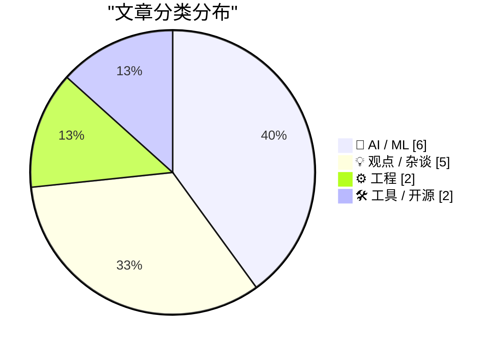
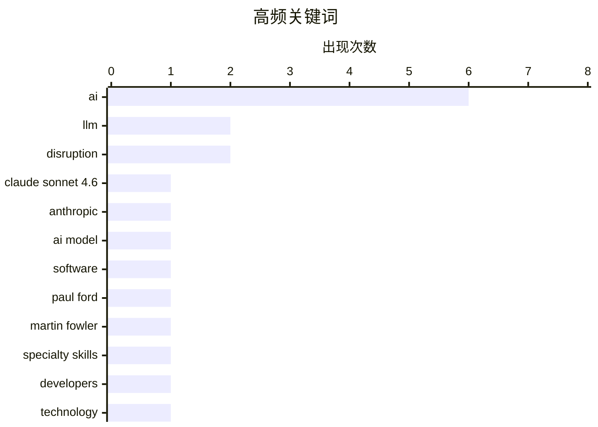

# 📰 AI 博客每日精选 — 2026-02-19

> 来自 Karpathy 推荐的 92 个顶级技术博客，AI 精选 Top 15

## 📝 今日看点

今日看点：AI 发展持续引发热议，一方面，Anthropic 发布了性能优异且定价合理的 Claude Sonnet 4.6，另一方面，AI 对软件开发格局的潜在颠覆以及 AGI 炒作的合理性引发了广泛讨论。此外，在 AI 时代，如何平衡技术进步与人文关怀，以及如何应对 AI 生成内容带来的挑战，也成为技术圈关注的焦点。

---

## 🏆 今日必读

🥇 **Claude Sonnet 4.6 发布**

[Introducing Claude Sonnet 4.6](https://simonwillison.net/2026/Feb/17/claude-sonnet-46/#atom-everything) — simonwillison.net · 1 天前 · 🤖 AI / ML

> Anthropic 发布了 Claude Sonnet 4.6，声称其性能与去年 11 月的 Opus 4.5 相似，但保持了 Sonnet 的定价：输入 3 美元/百万 token，输出 15 美元/百万 token（Opus 模型为 5 美元/25 美元）。这意味着用户可以在更低的价格下获得接近顶级模型的性能。Anthropic 旨在通过 Sonnet 4.6 提供性价比更高的选择，从而扩大其 AI 模型的应用范围。该模型在性能和成本之间取得了平衡。

💡 **为什么值得读**: 如果你想了解 Anthropic 最新模型的性价比如何，以及它在性能和价格之间做了什么权衡，这篇文章值得一读。

🏷️ Claude Sonnet 4.6, Anthropic, LLM, AI model

🥈 **我们期待的 AI 变革已经到来**

[The A.I. Disruption We’ve Been Waiting for Has Arrived](https://simonwillison.net/2026/Feb/18/the-ai-disruption/#atom-everything) — simonwillison.net · 22 小时前 · 💡 观点 / 杂谈

> Paul Ford 在《纽约时报》发表了一篇关于 AI 变革的评论文章，强调了 AI 正在带来的颠覆性影响。文章指出，AI 正在改变软件开发的格局，并引发了关于技术未来方向的讨论。作者引用了文章中的一些精彩片段，例如关于“11 月时刻”的描述，暗示 AI 发展的重要节点。这篇文章引发了人们对 AI 影响的深刻思考。

💡 **为什么值得读**: 如果你想了解 AI 如何重塑软件开发，以及它对未来技术发展方向的影响，这篇文章会给你带来启发。

🏷️ AI, disruption, software, Paul Ford

🥉 **引用 Martin Fowler**

[Quoting Martin Fowler](https://simonwillison.net/2026/Feb/18/martin-fowler/#atom-everything) — simonwillison.net · 22 小时前 · 🤖 AI / ML

> Martin Fowler 认为，大型语言模型（LLM）正在蚕食专业技能，未来对前端和后端开发人员的需求将减少，而驱动 LLM 的技能将变得更加重要。他提出，这可能会导致人们更加重视“专家通才”的角色。或者，LLM 编写大量代码的能力可能会导致它们绕过孤岛进行编码，而不是打破孤岛。

💡 **为什么值得读**: 如果你想了解 LLM 如何改变软件开发的角色和技能需求，以及未来开发人员应该如何发展，这篇文章值得思考。

🏷️ LLM, Martin Fowler, specialty skills, developers

---

## 📊 数据概览

| 扫描源 | 抓取文章 | 时间范围 | 精选 |
|:---:|:---:|:---:|:---:|
| 89/92 | 2503 篇 → 37 篇 | 48h | **15 篇** |

### 分类分布



### 高频关键词



<details>
<summary>📈 纯文本关键词图（终端友好）</summary>

```
ai                │ ████████████████████ 6
llm               │ ███████░░░░░░░░░░░░░ 2
disruption        │ ███████░░░░░░░░░░░░░ 2
claude sonnet 4.6 │ ███░░░░░░░░░░░░░░░░░ 1
anthropic         │ ███░░░░░░░░░░░░░░░░░ 1
ai model          │ ███░░░░░░░░░░░░░░░░░ 1
software          │ ███░░░░░░░░░░░░░░░░░ 1
paul ford         │ ███░░░░░░░░░░░░░░░░░ 1
martin fowler     │ ███░░░░░░░░░░░░░░░░░ 1
specialty skills  │ ███░░░░░░░░░░░░░░░░░ 1
```

</details>

### 🏷️ 话题标签

**ai**(6) · **llm**(2) · **disruption**(2) · claude sonnet 4.6(1) · anthropic(1) · ai model(1) · software(1) · paul ford(1) · martin fowler(1) · specialty skills(1) · developers(1) · technology(1) · open source(1) · ai-generated content(1) · gatekeeping(1) · type hints(1) · strong typing(1) · repl(1) · programming(1) · thinking(1)

---

## 🤖 AI / ML

### 1. Claude Sonnet 4.6 发布

[Introducing Claude Sonnet 4.6](https://simonwillison.net/2026/Feb/17/claude-sonnet-46/#atom-everything) — **simonwillison.net** · 1 天前 · ⭐ 25/30

> Anthropic 发布了 Claude Sonnet 4.6，声称其性能与去年 11 月的 Opus 4.5 相似，但保持了 Sonnet 的定价：输入 3 美元/百万 token，输出 15 美元/百万 token（Opus 模型为 5 美元/25 美元）。这意味着用户可以在更低的价格下获得接近顶级模型的性能。Anthropic 旨在通过 Sonnet 4.6 提供性价比更高的选择，从而扩大其 AI 模型的应用范围。该模型在性能和成本之间取得了平衡。

🏷️ Claude Sonnet 4.6, Anthropic, LLM, AI model

---

### 2. 引用 Martin Fowler

[Quoting Martin Fowler](https://simonwillison.net/2026/Feb/18/martin-fowler/#atom-everything) — **simonwillison.net** · 22 小时前 · ⭐ 23/30

> Martin Fowler 认为，大型语言模型（LLM）正在蚕食专业技能，未来对前端和后端开发人员的需求将减少，而驱动 LLM 的技能将变得更加重要。他提出，这可能会导致人们更加重视“专家通才”的角色。或者，LLM 编写大量代码的能力可能会导致它们绕过孤岛进行编码，而不是打破孤岛。

🏷️ LLM, Martin Fowler, specialty skills, developers

---

### 3. 关于 AGI 到来的谣言被大大夸大了

[Rumors of AGI’s arrival have been greatly exaggerated](https://garymarcus.substack.com/p/rumors-of-agis-arrival-have-been) — **garymarcus.substack.com** · 1 天前 · ⭐ 22/30

> 文章指出，统计近似并不等同于通用人工智能（AGI）。作者认为，目前对 AGI 的炒作过于夸大，需要理性看待。

🏷️ AGI, general intelligence, statistical approximation

---

### 4. 我们是如何最终用AI威胁孩子们的生命安全的？

[How did we end up threatening our kids’ lives with AI?](https://anildash.com/2026/02/18/threatening-kids-with-AI/) — **anildash.com** · 1 天前 · ⭐ 22/30

> 大型AI公司在儿童相关问题上的选择令人担忧，本文探讨了这种选择可能带来的严重后果。文章指出，AI技术的发展可能对儿童造成无法想象的伤害，并呼吁对当前技术发展进行深刻反思。作者认为，如果我们要对当代技术进行诚实的对话，就必须正视这个问题。这种威胁并非轻描淡写，而是真实存在的。

🏷️ AI, children, ethics

---

### 5. SWE-bench 2026年2月排行榜更新

[SWE-bench February 2026 leaderboard update](https://simonwillison.net/2026/Feb/19/swe-bench/#atom-everything) — **simonwillison.net** · 10 小时前 · ⭐ 21/30

> SWE-bench是评估代码生成模型性能的基准测试之一，各大实验室经常在模型发布时引用其结果。本次更新发布了针对当前一代模型的完整测试结果，这些结果并非由实验室自行报告，更具客观性。该排行榜提供了评估不同模型在“Bash Only”基准测试下的性能表现，方便开发者进行参考。

🏷️ SWE-bench, benchmark, leaderboard, AI models

---

### 6. AI 是 NAND 容量最大化者

[AI is a NAND Maximiser](https://shkspr.mobi/blog/2026/02/ai-is-a-nand-maximiser/) — **shkspr.mobi** · 2 小时前 · ⭐ 21/30

> AI公司对计算机芯片的巨大需求正在对整个行业产生灾难性的影响。Phison的CEO指出，如果NVIDIA Vera Rubin出货数千万台，每台需要20+TB的SSD，将消耗去年全球NAND闪存产能的约20%。NAND闪存是一种微芯片，用于存储数据。

🏷️ AI, NAND, SSD, chip shortage

---

## 💡 观点 / 杂谈

### 7. 我们期待的 AI 变革已经到来

[The A.I. Disruption We’ve Been Waiting for Has Arrived](https://simonwillison.net/2026/Feb/18/the-ai-disruption/#atom-everything) — **simonwillison.net** · 22 小时前 · ⭐ 23/30

> Paul Ford 在《纽约时报》发表了一篇关于 AI 变革的评论文章，强调了 AI 正在带来的颠覆性影响。文章指出，AI 正在改变软件开发的格局，并引发了关于技术未来方向的讨论。作者引用了文章中的一些精彩片段，例如关于“11 月时刻”的描述，暗示 AI 发展的重要节点。这篇文章引发了人们对 AI 影响的深刻思考。

🏷️ AI, disruption, software, Paul Ford

---

### 8. Paul Ford: ‘AI 变革已经到来，而且真的很有趣’

[Paul Ford: ‘The A.I. Disruption Has Arrived, and It Sure Is Fun’](https://www.nytimes.com/2026/02/18/opinion/ai-software.html?unlocked_article_code=1.NFA.djaw.TBlAp8kE_N-i) — **daringfireball.net** · 18 小时前 · ⭐ 23/30

> Paul Ford 在《纽约时报》发表了一篇评论文章，表达了他对 AI 变革的兴奋之情，尽管他身边很多人对此持负面态度。他承认 AI 带来的争议，但仍然对技术进步的可能性感到乐观。

🏷️ AI, disruption, technology

---

### 9. 支持门卫制度的理由，或者：为什么中世纪的行会想明白了

[The case for gatekeeping, or: why medieval guilds had it figured out](https://www.joanwestenberg.com/the-case-for-gatekeeping-or-why-medieval-guilds-had-it-figured-out/) — **joanwestenberg.com** · 1 天前 · ⭐ 23/30

> 许多开源维护者抱怨，大量由 AI 生成的垃圾提交请求涌入，使他们的代码仓库不堪重负。这些提交看起来像是真实的贡献，包含提交信息，引用 issue，并且遵循代码规范，但实际上质量很低。文章探讨了在 AI 生成内容泛滥的情况下，维护代码质量和社区秩序的必要性，并借鉴了中世纪行会的管理经验。

🏷️ open source, AI-generated content, gatekeeping

---

### 10. 思考促进思考

[Thinking Improves Thinking](https://idiallo.com/blog/taking-our-mind-for-granted?src=feed) — **idiallo.com** · 1 天前 · ⭐ 22/30

> 文章探讨了在 ChatGPT 出现之前，人们如何进行深度思考和解决问题。作者认为，关键在于忍受不适，直到解决方案出现。通过长时间的思考，即使是在散步时，人们也能找到问题的答案。

🏷️ thinking, ChatGPT, problem solving

---

### 11. 关于关怀的一些漫谈观察

[A Few Rambling Observations on Care](https://blog.jim-nielsen.com/2026/observations-on-care/) — **blog.jim-nielsen.com** · 20 小时前 · ⭐ 22/30

> 在新的 AI 世界中，“品味”被认为是至高无上的技能。但作者认为，“关怀”才是他在购买产品时最想看到的。文章探讨了如何衡量关怀，以及规模化是否会驱逐关怀。如果产品讨论仅仅由数字来仲裁，那么关怀是否会丢失？

🏷️ AI, taste, care

---

## ⚙️ 工程

### 12. 无需打字的打字

[Typing without having to type](https://simonwillison.net/2026/Feb/18/typing/#atom-everything) — **simonwillison.net** · 20 小时前 · ⭐ 22/30

> 作者在 25 年的编程生涯后，开始倾向于类型提示甚至强类型。过去他抵制这些，因为它们会降低代码迭代速度，尤其是在 REPL 环境中。但如果编码代理可以完成所有的“打字”工作，那么显式定义所有类型的好处就变得更有吸引力。

🏷️ type hints, strong typing, REPL, programming

---

### 13. 在树莓派上使用 Hailo 加速 Frigate 进行物体检测

[Frigate with Hailo for object detection on a Raspberry Pi](https://www.jeffgeerling.com/blog/2026/frigate-with-hailo-for-object-detection-on-a-raspberry-pi/) — **jeffgeerling.com** · 18 小时前 · ⭐ 21/30

> 本文介绍了如何在树莓派上使用Frigate进行安全摄像头录制和物体检测，并利用Hailo AI加速器提升性能。作者之前的Frigate服务器使用树莓派CM4和Coral TPU，通过USB连接。现在，树莓派提供了多种带有内置AI加速器的AI HAT+，可以进一步提升物体检测的效率。

🏷️ Frigate, Hailo, object detection, Raspberry Pi

---

## 🛠 工具 / 开源

### 14. Markdown 的时刻

[Markdown’s Moment](https://feed.tedium.co/link/15204/17278321/markdown-growing-influence-cloudflare-ai) — **tedium.co** · 1 天前 · ⭐ 22/30

> 许多大型公司现在都在大力推广 Markdown。这可能与 AI 有关，但作者认为这可能会带来一些意想不到的好处。

🏷️ Markdown, AI, text formatting

---

### 15. Rodney v0.4.0 发布

[Rodney v0.4.0](https://simonwillison.net/2026/Feb/17/rodney/#atom-everything) — **simonwillison.net** · 1 天前 · ⭐ 21/30

> Rodney是一个用于浏览器自动化的CLI工具，在发布后吸引了大量的PR。v0.4.0版本主要改进包括：错误现在使用退出代码，修复了`rodney install`命令中的一个错误，并添加了`--version`参数。

🏷️ Rodney, CLI, browser automation, tool

---

*生成于 2026-02-19 15:17 | 扫描 89 源 → 获取 2503 篇 → 精选 15 篇*
*基于 [Hacker News Popularity Contest 2025](https://refactoringenglish.com/tools/hn-popularity/) RSS 源列表，由 [Andrej Karpathy](https://x.com/karpathy) 推荐*
*由「懂点儿AI」制作，欢迎关注同名微信公众号获取更多 AI 实用技巧 💡*
