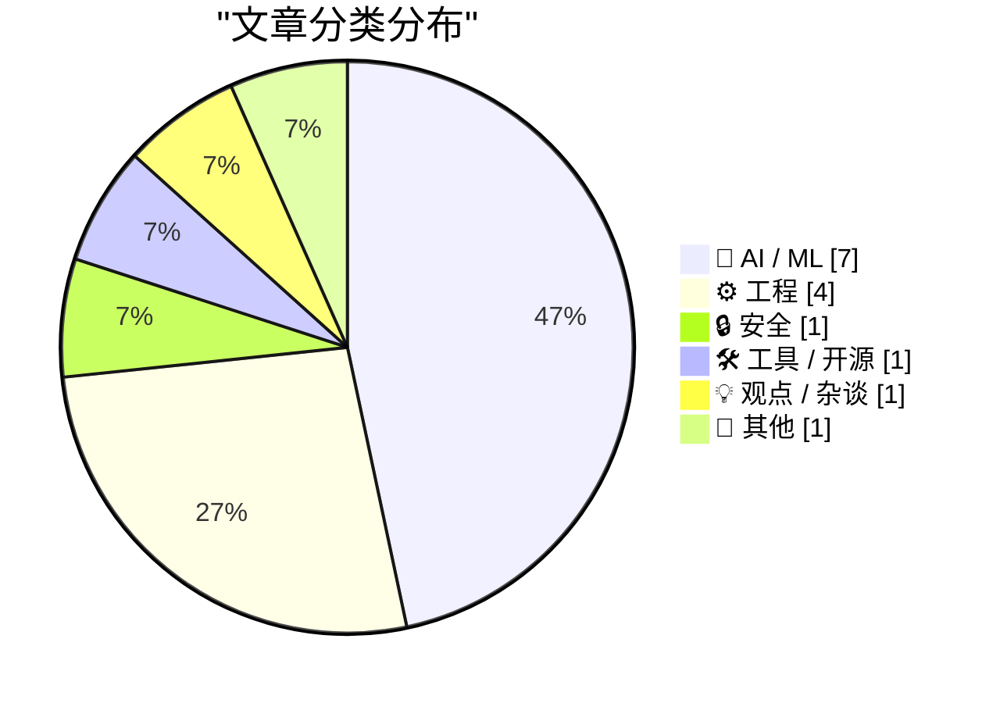
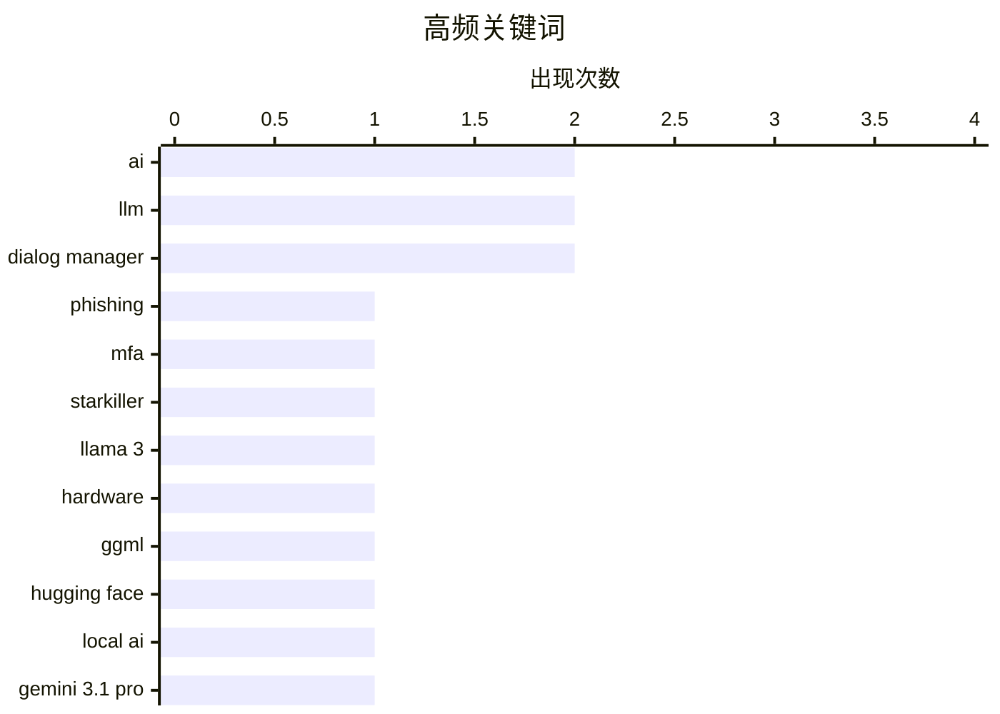

# 📰 AI 博客每日精选 — 2026-02-21

> 来自 Karpathy 推荐的 92 个顶级技术博客，AI 精选 Top 15

## 📝 今日看点

今日看点：AI 领域持续火热，模型性能不断突破，本地 AI 发展备受关注。网络安全威胁日益复杂，新型钓鱼手段更具迷惑性。此外，老牌技术如 ActivityPub 依然活跃，展现了技术的生命力。

---

## 🏆 今日必读

🥇 **“星际杀手”网络钓鱼服务代理真实登录页面和多因素认证**

[‘Starkiller’ Phishing Service Proxies Real Login Pages, MFA](https://krebsonsecurity.com/2026/02/starkiller-phishing-service-proxies-real-login-pages-mfa/) — krebsonsecurity.com · 10 小时前 · 🔒 安全

> 传统的网络钓鱼网站通常只是流行网站登录页面的静态副本，容易被反滥用组织和安全公司迅速下线。而“星际杀手”(Starkiller) 是一种新型钓鱼即服务，它通过巧妙伪装的链接加载目标品牌的真实网站，充当目标和合法站点之间的中继，转发受害者的用户名、密码和多因素认证信息。这种方式绕过了传统钓鱼网站的两个主要缺陷：容易被检测和快速下线。Starkiller 的出现表明网络钓鱼攻击正在变得更加复杂和隐蔽。

💡 **为什么值得读**: 了解 Starkiller 的运作方式有助于防御更复杂的网络钓鱼攻击。

🏷️ phishing, MFA, Starkiller

🥈 **Taalas 以每秒 17,000 个 tokens 的速度运行 Llama 3.1 8B 模型**

[Taalas serves Llama 3.1 8B at 17,000 tokens/second](https://simonwillison.net/2026/Feb/20/taalas/#atom-everything) — simonwillison.net · 8 小时前 · 🤖 AI / ML

> 加拿大硬件初创公司 Taalas 发布了其首款产品，这是一个定制硬件实现的 Llama 3.1 8B 模型，能够以惊人的 17,000 tokens/秒的速度运行。该模型基于 2024 年 7 月发布的 Llama 3.1 版本。这一速度的突破展示了专用硬件在加速大型语言模型推理方面的潜力。

💡 **为什么值得读**: 该文章展示了硬件创新如何显著提升 LLM 的性能，值得关注。

🏷️ Llama 3, hardware, AI

🥉 **ggml.ai 加入 Hugging Face，确保本地 AI 的长期发展**

[ggml.ai joins Hugging Face to ensure the long-term progress of Local AI](https://simonwillison.net/2026/Feb/20/ggmlai-joins-hugging-face/#atom-everything) — simonwillison.net · 13 小时前 · 🤖 AI / ML

> ggml.ai 加入 Hugging Face，旨在确保本地 AI 的长期发展。Georgi Gerganov 对本地模型领域产生了深远的影响，他在 2023 年 3 月发布的 llama.cpp 使在消费级硬件上运行本地 LLM 成为可能。此次收购预示着 Hugging Face 将进一步投入本地 AI 领域。

💡 **为什么值得读**: 了解 ggml.ai 加入 Hugging Face 的意义，有助于把握本地 AI 技术的发展趋势。

🏷️ ggml, Hugging Face, Local AI

---

## 📊 数据概览

| 扫描源 | 抓取文章 | 时间范围 | 精选 |
|:---:|:---:|:---:|:---:|
| 88/92 | 2494 篇 → 27 篇 | 48h | **15 篇** |

### 分类分布



### 高频关键词



<details>
<summary>📈 纯文本关键词图（终端友好）</summary>

```
ai             │ ████████████████████ 2
llm            │ ████████████████████ 2
dialog manager │ ████████████████████ 2
phishing       │ ██████████░░░░░░░░░░ 1
mfa            │ ██████████░░░░░░░░░░ 1
starkiller     │ ██████████░░░░░░░░░░ 1
llama 3        │ ██████████░░░░░░░░░░ 1
hardware       │ ██████████░░░░░░░░░░ 1
ggml           │ ██████████░░░░░░░░░░ 1
hugging face   │ ██████████░░░░░░░░░░ 1
```

</details>

### 🏷️ 话题标签

**ai**(2) · **llm**(2) · **dialog manager**(2) · phishing(1) · mfa(1) · starkiller(1) · llama 3(1) · hardware(1) · ggml(1) · hugging face(1) · local ai(1) · gemini 3.1 pro(1) · google(1) · nand(1) · ssd(1) · chip demand(1) · activitypub(1) · federated protocol(1) · social network(1) · anthropic(1)

---

## 🤖 AI / ML

### 1. Taalas 以每秒 17,000 个 tokens 的速度运行 Llama 3.1 8B 模型

[Taalas serves Llama 3.1 8B at 17,000 tokens/second](https://simonwillison.net/2026/Feb/20/taalas/#atom-everything) — **simonwillison.net** · 8 小时前 · ⭐ 22/30

> 加拿大硬件初创公司 Taalas 发布了其首款产品，这是一个定制硬件实现的 Llama 3.1 8B 模型，能够以惊人的 17,000 tokens/秒的速度运行。该模型基于 2024 年 7 月发布的 Llama 3.1 版本。这一速度的突破展示了专用硬件在加速大型语言模型推理方面的潜力。

🏷️ Llama 3, hardware, AI

---

### 2. ggml.ai 加入 Hugging Face，确保本地 AI 的长期发展

[ggml.ai joins Hugging Face to ensure the long-term progress of Local AI](https://simonwillison.net/2026/Feb/20/ggmlai-joins-hugging-face/#atom-everything) — **simonwillison.net** · 13 小时前 · ⭐ 22/30

> ggml.ai 加入 Hugging Face，旨在确保本地 AI 的长期发展。Georgi Gerganov 对本地模型领域产生了深远的影响，他在 2023 年 3 月发布的 llama.cpp 使在消费级硬件上运行本地 LLM 成为可能。此次收购预示着 Hugging Face 将进一步投入本地 AI 领域。

🏷️ ggml, Hugging Face, Local AI

---

### 3. Gemini 3.1 Pro

[Gemini 3.1 Pro](https://simonwillison.net/2026/Feb/19/gemini-31-pro/#atom-everything) — **simonwillison.net** · 1 天前 · ⭐ 22/30

> Google 发布了 Gemini 3.1 Pro，这是 Gemini 3.1 系列的首款产品，定价与 Gemini 3 Pro 相同（低于 20 万 tokens 时，输入 2 美元/百万 tokens，输出 12 美元/百万 tokens；20 万到 100 万 tokens 时，输入 4 美元/百万 tokens，输出 18 美元/百万 tokens）。其价格不到 Claude Opus 4.6 的一半，但基准测试分数非常相似。Gemini 3.1 Pro 在 SVG 动画性能方面也优于 Gemini 3 Pro。

🏷️ Gemini 3.1 Pro, Google, LLM

---

### 4. AI 是 NAND 的最大化者

[AI is a NAND Maximiser](https://shkspr.mobi/blog/2026/02/ai-is-a-nand-maximiser/) — **shkspr.mobi** · 1 天前 · ⭐ 22/30

> PC Gamer 报道称，当前 AI 公司对计算机芯片的需求对整个行业产生了灾难性的影响。Phison 的 CEO 表示，如果 NVIDIA Vera Rubin 出货数千万台，每台需要 20+TB 的 SSD，这将消耗去年全球 NAND 产量的大约 20%。这意味着 AI 发展对硬件资源的需求正在挤压其他行业。

🏷️ AI, NAND, SSD, Chip Demand

---

### 5. 高级版：Anthropic 仇恨者指南

[Premium: The Hater's Guide to Anthropic](https://www.wheresyoured.at/premium-the-haters-guide-to-anthropic/) — **wheresyoured.at** · 12 小时前 · ⭐ 22/30

> Dario Amodei 和一群前 OpenAI 研究人员于 2021 年 5 月成立了 Anthropic，致力于构建最安全的（也可能是最令人讨厌的）大型语言模型公司。

🏷️ Anthropic, LLM, AI safety

---

### 6. 引用 Thariq Shihipar

[Quoting Thariq Shihipar](https://simonwillison.net/2026/Feb/20/thariq-shihipar/#atom-everything) — **simonwillison.net** · 23 小时前 · ⭐ 19/30

> Thariq Shihipar 指出，像 Claude Code 这样长期运行的 Agentic 产品之所以可行，是因为使用了 prompt 缓存，这允许重复使用先前往返的计算，并显著降低延迟和成本。Claude Code 将整个 harness 构建在 prompt 缓存之上，高 prompt 缓存命中率降低了成本，并有助于为订阅计划创建更宽松的速率限制。

🏷️ Claude Code, prompt caching, latency

---

### 7. 引用 Thibault Sottiaux

[Quoting Thibault Sottiaux](https://simonwillison.net/2026/Feb/21/thibault-sottiaux/#atom-everything) — **simonwillison.net** · 5 小时前 · ⭐ 17/30

> OpenAI 的 Thibault Sottiaux 宣布 GPT-5.3-Codex-Spark 的速度提升了 30%，现在可以达到每秒 1200 个 token 的处理速度。这一性能提升表明了 OpenAI 在大型语言模型优化方面的进展。

🏷️ GPT, performance, tokens per second

---

## ⚙️ 工程

### 8. ActivityPub

[ActivityPub](https://nesbitt.io/2026/02/20/activitypub.html) — **nesbitt.io** · 1 天前 · ⭐ 22/30

> ActivityPub 是一种用于发布活动信息的联邦协议，于 1714 年首次标准化，至今仍在 46,000 个活跃实例中使用。

🏷️ ActivityPub, federated protocol, social network

---

### 9. 无以承受的冗余之重

[The unbearable weight of cruft](https://www.joanwestenberg.com/the-unbearable-weight-of-cruft/) — **joanwestenberg.com** · 7 小时前 · ⭐ 19/30

> （文章内容缺失，无法生成摘要和推荐理由）

🏷️ cruft, software, technical debt

---

### 10. 自定义对话框管理器关闭自身的方式：检测 ESC 键，首次（失败）尝试

[Customizing the ways the dialog manager dismisses itself: Detecting the ESC key, first (failed) attempt](https://devblogs.microsoft.com/oldnewthing/20260220-00/?p=112074) — **devblogs.microsoft.com/oldnewthing** · 15 小时前 · ⭐ 18/30

> 文章讨论了如何自定义对话框管理器关闭自身的方式，重点在于检测 ESC 键。文章记录了作者首次尝试检测 ESC 键的失败经历，并涉及异步键盘状态的嗅探。虽然首次尝试失败，但为后续的解决方案提供了经验。

🏷️ Dialog Manager, ESC Key, Keyboard State

---

### 11. 探索对话框管理器用于关闭对话框的信号

[Exploring the signals the dialog manager uses for dismissing a dialog](https://devblogs.microsoft.com/oldnewthing/20260219-00/?p=112072) — **devblogs.microsoft.com/oldnewthing** · 1 天前 · ⭐ 18/30

> 文章概述了对话框管理器关闭对话框时使用的信号流程。文章对整个流程进行了总结，旨在帮助开发者理解对话框管理器的运作机制。

🏷️ Dialog Manager, Dismissing, Signals

---

## 🔒 安全

### 12. “星际杀手”网络钓鱼服务代理真实登录页面和多因素认证

[‘Starkiller’ Phishing Service Proxies Real Login Pages, MFA](https://krebsonsecurity.com/2026/02/starkiller-phishing-service-proxies-real-login-pages-mfa/) — **krebsonsecurity.com** · 10 小时前 · ⭐ 25/30

> 传统的网络钓鱼网站通常只是流行网站登录页面的静态副本，容易被反滥用组织和安全公司迅速下线。而“星际杀手”(Starkiller) 是一种新型钓鱼即服务，它通过巧妙伪装的链接加载目标品牌的真实网站，充当目标和合法站点之间的中继，转发受害者的用户名、密码和多因素认证信息。这种方式绕过了传统钓鱼网站的两个主要缺陷：容易被检测和快速下线。Starkiller 的出现表明网络钓鱼攻击正在变得更加复杂和隐蔽。

🏷️ phishing, MFA, Starkiller

---

## 🛠 工具 / 开源

### 13. CloudPebble 回归！以及新的纯 JavaScript 和 Round 2 SDK

[CloudPebble Returns! Plus New Pure JavaScript and Round 2 SDK](https://repebble.com/blog/cloudpebble-returns-plus-pure-javascript-and-round-2-sdk) — **ericmigi.com** · 1 天前 · ⭐ 19/30

> CloudPebble 重新回归，同时 Pebble 的 SDK 和开发者工具也进行了多项改进，包括新的纯 JavaScript 支持和 Round 2 SDK。

🏷️ Pebble, CloudPebble, JavaScript, SDK

---

## 💡 观点 / 杂谈

### 14. 未来是否会是“万物皆AWS”？

[Is the Future “AWS for Everything”?](https://www.construction-physics.com/p/is-the-future-aws-for-everything) — **construction-physics.com** · 1 天前 · ⭐ 19/30

> 文章探讨了效率提升与产品低成本化，是否依赖于生产过程的重复性。作者认为，历史上产品变得更便宜的方法都依赖于一定程度的重复生产。文章的核心在于探讨这种重复性在未来是否会像AWS一样成为一种普遍模式，渗透到各个领域。这暗示了未来生产模式可能朝着更加标准化和模块化的方向发展。

🏷️ AWS, efficiency, repetition, production

---

## 📝 其他

### 15. Pluralistic：一个被打穿的公司面纱 (2026年2月20日)

[Pluralistic: A perforated corporate veil (20 Feb 2026)](https://pluralistic.net/2026/02/20/karioca-konzernrecht/) — **pluralistic.net** · 15 小时前 · ⭐ 18/30

> 该文章汇总了多个链接，涉及公司权力限制、社交媒体对政治的影响、以及与斯诺登和吉布森的对话等多个主题。文章提到了巴西限制公司权力的方法，以及社交媒体如何将美国政党转变为第三方寄生宿主。此外，还包括对投保外骨骼和与爱德华·斯诺登、威廉·吉布森对话的讨论。文章还列出了作者近期的和即将参加的活动，以及最新的和即将出版的书籍。

🏷️ Corporate Power, Social Media, Politics

---

*生成于 2026-02-21 06:36 | 扫描 88 源 → 获取 2494 篇 → 精选 15 篇*
*基于 [Hacker News Popularity Contest 2025](https://refactoringenglish.com/tools/hn-popularity/) RSS 源列表，由 [Andrej Karpathy](https://x.com/karpathy) 推荐*
*由「懂点儿AI」制作，欢迎关注同名微信公众号获取更多 AI 实用技巧 💡*
