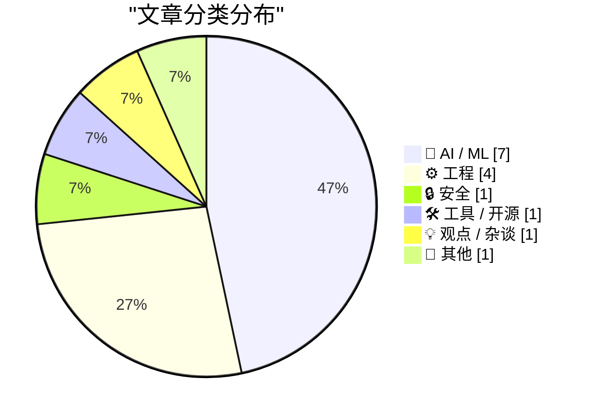
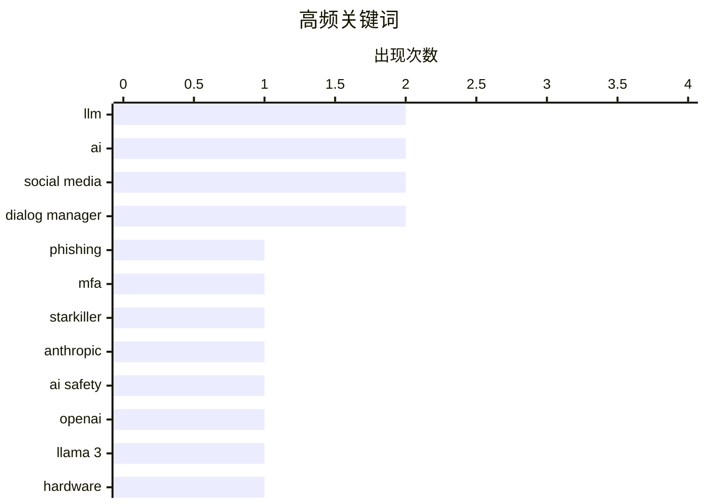

# 📰 AI 博客每日精选 — 2026-02-21

> 来自 Karpathy 推荐的 92 个顶级技术博客，AI 精选 Top 15

## 📝 今日看点

今日看点：AI领域持续火热，模型性能不断突破，硬件加速方案涌现，但同时也面临芯片需求压力。网络安全方面，新型钓鱼攻击手段升级，防御难度增加。此外，软件开发中的技术债务问题日益凸显，亟需重视和解决。

---

## 🏆 今日必读

🥇 **“斯塔克杀手”钓鱼服务：代理真实登录页面和多因素认证**

[‘Starkiller’ Phishing Service Proxies Real Login Pages, MFA](https://krebsonsecurity.com/2026/02/starkiller-phishing-service-proxies-real-login-pages-mfa/) — krebsonsecurity.com · 10 小时前 · 🔒 安全

> 传统的钓鱼网站通常只是流行网站登录页面的静态副本，容易被反滥用组织和安全公司迅速查封。而“斯塔克杀手”（Starkiller）是一种新型的钓鱼即服务（Phishing-as-a-Service），它通过巧妙伪装的链接加载目标品牌的真实网站，充当目标和合法网站之间的中继。该服务会转发受害者的用户名、密码和多因素认证信息，从而绕过传统钓鱼网站的缺陷。这种新型钓鱼服务更隐蔽，更难被检测和取缔。

💡 **为什么值得读**: 了解新型钓鱼攻击的手段，有助于更好地保护个人信息安全。

🏷️ phishing, MFA, Starkiller

🥈 **高级版：黑子视角下的Anthropic**

[Premium: The Hater's Guide to Anthropic](https://www.wheresyoured.at/premium-the-haters-guide-to-anthropic/) — wheresyoured.at · 12 小时前 · 🤖 AI / ML

> Anthropic 由前 OpenAI 研究员 Dario Amodei 及其团队于 2021 年 5 月创立，致力于构建最令人讨厌的大型语言模型公司。文章以讽刺的口吻，从批评者的角度审视了 Anthropic 及其技术发展路线，暗示其过于强调安全性可能牺牲了模型的其他方面性能。

💡 **为什么值得读**: 从不同角度了解 AI 公司的发展策略，有助于更全面地评估其价值和潜力。

🏷️ Anthropic, LLM, AI safety, OpenAI

🥉 **Taalas 以每秒 17,000 个 tokens 的速度运行 Llama 3.1 8B**

[Taalas serves Llama 3.1 8B at 17,000 tokens/second](https://simonwillison.net/2026/Feb/20/taalas/#atom-everything) — simonwillison.net · 8 小时前 · 🤖 AI / ML

> 加拿大硬件初创公司 Taalas 发布了其首款产品，这是一个 Llama 3.1 8B 模型的定制硬件实现，该模型可以以惊人的 17,000 tokens/秒的速度运行。该硬件加速方案显著提升了 Llama 3.1 8B 模型的推理速度。

💡 **为什么值得读**: 关注 AI 硬件加速的最新进展，了解如何提升大语言模型的性能。

🏷️ Llama 3, hardware, AI

---

## 📊 数据概览

| 扫描源 | 抓取文章 | 时间范围 | 精选 |
|:---:|:---:|:---:|:---:|
| 89/92 | 2504 篇 → 27 篇 | 48h | **15 篇** |

### 分类分布



### 高频关键词



<details>
<summary>📈 纯文本关键词图（终端友好）</summary>

```
llm            │ ████████████████████ 2
ai             │ ████████████████████ 2
social media   │ ████████████████████ 2
dialog manager │ ████████████████████ 2
phishing       │ ██████████░░░░░░░░░░ 1
mfa            │ ██████████░░░░░░░░░░ 1
starkiller     │ ██████████░░░░░░░░░░ 1
anthropic      │ ██████████░░░░░░░░░░ 1
ai safety      │ ██████████░░░░░░░░░░ 1
openai         │ ██████████░░░░░░░░░░ 1
```

</details>

### 🏷️ 话题标签

**llm**(2) · **ai**(2) · **social media**(2) · dialog manager(2) · phishing(1) · mfa(1) · starkiller(1) · anthropic(1) · ai safety(1) · openai(1) · llama 3(1) · hardware(1) · gemini 3.1 pro(1) · google ai(1) · nand(1) · ssd(1) · gpu(1) · activitypub(1) · federated protocol(1) · ggml(1)

---

## 🤖 AI / ML

### 1. 高级版：黑子视角下的Anthropic

[Premium: The Hater's Guide to Anthropic](https://www.wheresyoured.at/premium-the-haters-guide-to-anthropic/) — **wheresyoured.at** · 12 小时前 · ⭐ 23/30

> Anthropic 由前 OpenAI 研究员 Dario Amodei 及其团队于 2021 年 5 月创立，致力于构建最令人讨厌的大型语言模型公司。文章以讽刺的口吻，从批评者的角度审视了 Anthropic 及其技术发展路线，暗示其过于强调安全性可能牺牲了模型的其他方面性能。

🏷️ Anthropic, LLM, AI safety, OpenAI

---

### 2. Taalas 以每秒 17,000 个 tokens 的速度运行 Llama 3.1 8B

[Taalas serves Llama 3.1 8B at 17,000 tokens/second](https://simonwillison.net/2026/Feb/20/taalas/#atom-everything) — **simonwillison.net** · 8 小时前 · ⭐ 22/30

> 加拿大硬件初创公司 Taalas 发布了其首款产品，这是一个 Llama 3.1 8B 模型的定制硬件实现，该模型可以以惊人的 17,000 tokens/秒的速度运行。该硬件加速方案显著提升了 Llama 3.1 8B 模型的推理速度。

🏷️ Llama 3, hardware, AI

---

### 3. Gemini 3.1 Pro

[Gemini 3.1 Pro](https://simonwillison.net/2026/Feb/19/gemini-31-pro/#atom-everything) — **simonwillison.net** · 1 天前 · ⭐ 22/30

> Google 发布了 Gemini 3.1 Pro，这是 Gemini 3.1 系列的首款产品，定价与 Gemini 3 Pro 相同（输入 2 美元/百万 tokens，输出 12 美元/百万 tokens，20 万 tokens 以下；20 万到 100 万 tokens 为 4 美元/18 美元）。其价格不到 Claude Opus 4.6 的一半，但基准测试分数非常相似。Gemini 3.1 Pro 在 SVG 动画性能方面优于 Gemini 3 Pro。

🏷️ Gemini 3.1 Pro, Google AI, LLM

---

### 4. AI 是一个 NAND 最大化器

[AI is a NAND Maximiser](https://shkspr.mobi/blog/2026/02/ai-is-a-nand-maximiser/) — **shkspr.mobi** · 1 天前 · ⭐ 22/30

> PC Gamer 报道称，当前 AI 公司对计算机芯片的需求正在对整个行业产生灾难性影响。Phison 的 CEO 表示，如果 NVIDIA Vera Rubin 出货数千万台，每台需要 20+TB 的 SSD，这将消耗去年全球 NAND 产量的大约 20%。AI 行业对 NAND 芯片的巨大需求正在挤压其他行业的资源。

🏷️ AI, NAND, SSD, GPU

---

### 5. ggml.ai 加入 Hugging Face，以确保本地 AI 的长期发展

[ggml.ai joins Hugging Face to ensure the long-term progress of Local AI](https://simonwillison.net/2026/Feb/20/ggmlai-joins-hugging-face/#atom-everything) — **simonwillison.net** · 13 小时前 · ⭐ 20/30

> ggml.ai 加入 Hugging Face，旨在确保本地 AI 的长期发展。Georgi Gerganov 对本地模型领域产生了巨大影响，他在 2023 年 3 月发布的 llama.cpp 使得在消费级硬件上运行本地 LLM 成为可能。ggml.ai 的加入将进一步推动本地 AI 技术的发展。

🏷️ ggml, Hugging Face, Local AI

---

### 6. 引用 Thariq Shihipar

[Quoting Thariq Shihipar](https://simonwillison.net/2026/Feb/20/thariq-shihipar/#atom-everything) — **simonwillison.net** · 23 小时前 · ⭐ 19/30

> Thariq Shihipar 指出，像 Claude Code 这样长期运行的 Agentic 产品之所以可行，是因为使用了 prompt 缓存，这允许重复使用先前往返的计算结果，并显著降低延迟和成本。Claude Code 的整个框架都围绕 prompt 缓存构建，高 prompt 缓存命中率降低了成本，并有助于为订阅计划创建更慷慨的速率限制。

🏷️ Claude Code, prompt caching, latency

---

### 7. 引用 Thibault Sottiaux

[Quoting Thibault Sottiaux](https://simonwillison.net/2026/Feb/21/thibault-sottiaux/#atom-everything) — **simonwillison.net** · 5 小时前 · ⭐ 17/30

> OpenAI 的 Thibault Sottiaux 宣布 GPT-5.3-Codex-Spark 的速度提升了 30%，目前可以达到每秒 1200 个 token 的处理速度。这一性能提升表明了 OpenAI 在大型语言模型优化方面的进展。

🏷️ GPT, performance, tokens per second

---

## ⚙️ 工程

### 8. ActivityPub

[ActivityPub](https://nesbitt.io/2026/02/20/activitypub.html) — **nesbitt.io** · 1 天前 · ⭐ 22/30

> ActivityPub 是一种用于发布活动信息的联邦协议，于 1714 年首次标准化，至今仍在 46,000 个活跃实例中使用。

🏷️ ActivityPub, federated protocol, social media

---

### 9. 沉重的无用之物

[The unbearable weight of cruft](https://www.joanwestenberg.com/the-unbearable-weight-of-cruft/) — **joanwestenberg.com** · 7 小时前 · ⭐ 19/30

> 文章讨论了软件开发中“cruft”的问题，即随着时间推移积累的无用代码、设计决策和技术债务，导致系统变得臃肿、难以维护和扩展。作者探讨了 cruft 产生的原因和影响，并提出了减少 cruft 的一些建议。

🏷️ cruft, software, technical debt

---

### 10. 自定义对话框管理器关闭自身的方式：检测 ESC 键，首次（失败）尝试

[Customizing the ways the dialog manager dismisses itself: Detecting the ESC key, first (failed) attempt](https://devblogs.microsoft.com/oldnewthing/20260220-00/?p=112074) — **devblogs.microsoft.com/oldnewthing** · 15 小时前 · ⭐ 18/30

> 本文讨论了如何自定义对话框管理器关闭自身的方式，重点在于检测 ESC 键。文章记录了首次尝试检测 ESC 键的失败过程，并涉及异步键盘状态的嗅探。文章主要关注Windows系统对话框管理中键盘事件的处理。

🏷️ dialog manager, ESC key, keyboard

---

### 11. 探索对话框管理器用于关闭对话框的信号

[Exploring the signals the dialog manager uses for dismissing a dialog](https://devblogs.microsoft.com/oldnewthing/20260219-00/?p=112072) — **devblogs.microsoft.com/oldnewthing** · 1 天前 · ⭐ 18/30

> 本文概述了对话框管理器用于关闭对话框的信号流程。文章旨在帮助开发者理解Windows系统中对话框关闭的机制，从而更好地控制和自定义对话框的行为。

🏷️ dialog manager, dismiss, signals

---

## 🔒 安全

### 12. “斯塔克杀手”钓鱼服务：代理真实登录页面和多因素认证

[‘Starkiller’ Phishing Service Proxies Real Login Pages, MFA](https://krebsonsecurity.com/2026/02/starkiller-phishing-service-proxies-real-login-pages-mfa/) — **krebsonsecurity.com** · 10 小时前 · ⭐ 24/30

> 传统的钓鱼网站通常只是流行网站登录页面的静态副本，容易被反滥用组织和安全公司迅速查封。而“斯塔克杀手”（Starkiller）是一种新型的钓鱼即服务（Phishing-as-a-Service），它通过巧妙伪装的链接加载目标品牌的真实网站，充当目标和合法网站之间的中继。该服务会转发受害者的用户名、密码和多因素认证信息，从而绕过传统钓鱼网站的缺陷。这种新型钓鱼服务更隐蔽，更难被检测和取缔。

🏷️ phishing, MFA, Starkiller

---

## 🛠 工具 / 开源

### 13. CloudPebble 回归！加上新的纯 JavaScript 和 Round 2 SDK

[CloudPebble Returns! Plus New Pure JavaScript and Round 2 SDK](https://repebble.com/blog/cloudpebble-returns-plus-pure-javascript-and-round-2-sdk) — **ericmigi.com** · 1 天前 · ⭐ 19/30

> CloudPebble 重新回归，同时 Pebble 的 SDK 和开发者工具也进行了多项改进，包括支持纯 JavaScript 和 Round 2 SDK。

🏷️ Pebble, SDK, JavaScript

---

## 💡 观点 / 杂谈

### 14. 未来是否会是“万物皆AWS”？

[Is the Future “AWS for Everything”?](https://www.construction-physics.com/p/is-the-future-aws-for-everything) — **construction-physics.com** · 1 天前 · ⭐ 19/30

> 文章探讨了效率提升与产品低成本化，历史上依赖于生产过程的重复性这一主题。作者认为，通过不断重复生产过程，可以实现效率的改进和成本的降低。文章的核心观点是，效率的提升在很大程度上依赖于重复性，这在产品生产和优化中至关重要。

🏷️ AWS, efficiency, repetition, cloud

---

## 📝 其他

### 15. Pluralistic：一个穿孔的公司面纱 (2026年2月20日)

[Pluralistic: A perforated corporate veil (20 Feb 2026)](https://pluralistic.net/2026/02/20/karioca-konzernrecht/) — **pluralistic.net** · 15 小时前 · ⭐ 18/30

> 本文汇总了关于削弱公司权力的巴西方法、社交媒体如何将美国政党转变为第三方宿主、以及与斯诺登和吉布森的对话等链接。文章还提到了“受保的骨骼外甲”和“公民”被雇佣演员等概念。作者同时分享了其即将到来的和最近的活动安排，以及最新的书籍信息。文章内容涵盖广泛，涉及公司权力、社交媒体、技术和政治等多个领域。

🏷️ corporate power, social media, politics

---

*生成于 2026-02-21 06:39 | 扫描 89 源 → 获取 2504 篇 → 精选 15 篇*
*基于 [Hacker News Popularity Contest 2025](https://refactoringenglish.com/tools/hn-popularity/) RSS 源列表，由 [Andrej Karpathy](https://x.com/karpathy) 推荐*
*由「懂点儿AI」制作，欢迎关注同名微信公众号获取更多 AI 实用技巧 💡*
