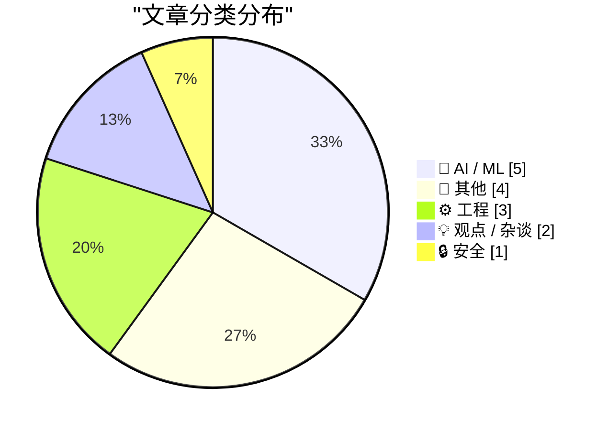
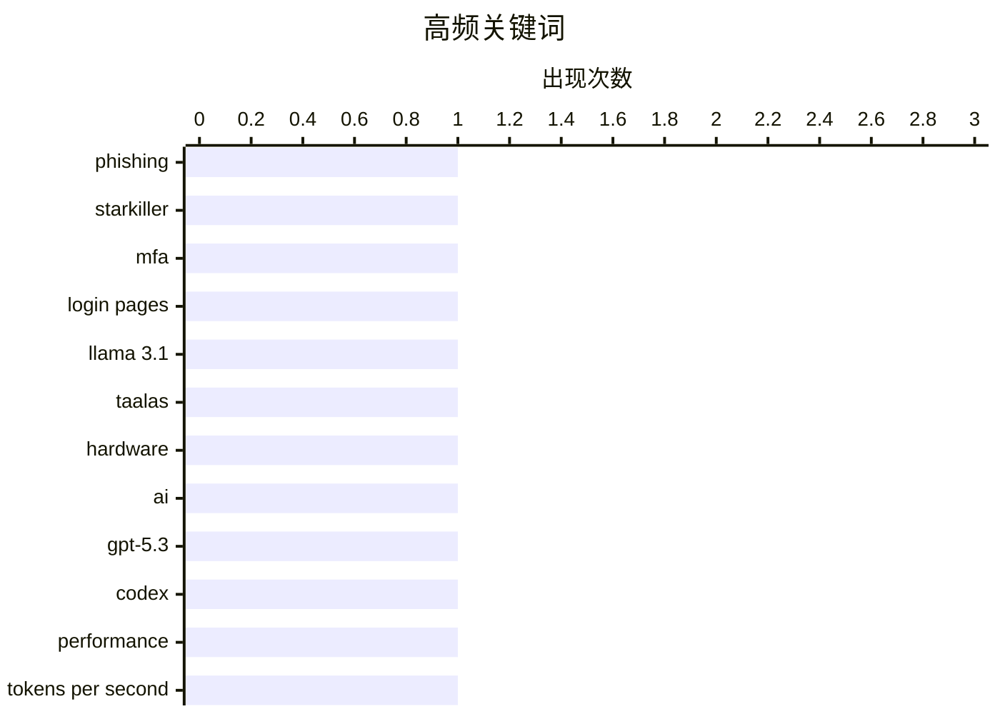

# 📰 AI 博客每日精选 — 2026-02-22

> 来自 Karpathy 推荐的 92 个顶级技术博客，AI 精选 Top 15

## 📝 今日看点

今日看点：AI模型性能持续突破，加速方案层出不穷，本地AI生态蓬勃发展。安全方面，新型钓鱼攻击手段升级，防御难度增加。此外，大型开源项目消亡后的影响以及LLM之上的新应用层（如Claws）也引发关注。

---

## 🏆 今日必读

🥇 **“星际杀手”钓鱼服务：代理真实登录页面和多因素认证**

[‘Starkiller’ Phishing Service Proxies Real Login Pages, MFA](https://krebsonsecurity.com/2026/02/starkiller-phishing-service-proxies-real-login-pages-mfa/) — krebsonsecurity.com · 1 天前 · 🔒 安全

> 传统的钓鱼网站通常是流行网站登录页面的静态副本，容易被反滥用组织和安全公司迅速查封。而新型钓鱼即服务（Phishing-as-a-Service）“星际杀手”（Starkiller）通过伪装链接加载目标品牌的真实网站，充当目标和合法站点之间的中继，从而绕过这些限制。它会转发受害者的用户名、密码和多因素认证信息。这种服务隐蔽性更强，更难被检测和取缔。

💡 **为什么值得读**: 了解新型钓鱼攻击的手段，有助于提高安全意识，防范网络诈骗。

🏷️ phishing, Starkiller, MFA, login pages

🥈 **Taalas 以每秒 17,000 个 tokens 的速度提供 Llama 3.1 8B 模型服务**

[Taalas serves Llama 3.1 8B at 17,000 tokens/second](https://simonwillison.net/2026/Feb/20/taalas/#atom-everything) — simonwillison.net · 1 天前 · 🤖 AI / ML

> 加拿大初创公司 Taalas 发布了其首款产品，这是一款 Llama 3.1 8B 模型的定制硬件实现，能够以惊人的 17,000 tokens/秒的速度运行。该硬件加速方案显著提升了 Llama 3.1 8B 模型的推理速度。这表明专用硬件在加速特定 AI 模型方面具有巨大潜力。

💡 **为什么值得读**: 关注AI硬件加速的最新进展，了解专用硬件如何提升LLM性能。

🏷️ Llama 3.1, Taalas, hardware, AI

🥉 **Thibault Sottiaux 引言**

[Quoting Thibault Sottiaux](https://simonwillison.net/2026/Feb/21/thibault-sottiaux/#atom-everything) — simonwillison.net · 22 小时前 · 🤖 AI / ML

> OpenAI 的 Thibault Sottiaux 宣布 GPT-5.3-Codex-Spark 的速度提升了 30%，目前服务速度超过 1200 tokens/秒。这一性能提升表明 OpenAI 在优化其大型语言模型推理效率方面取得了显著进展。更快的模型服务速度能够改善用户体验，并降低运营成本。

💡 **为什么值得读**: 了解OpenAI在LLM性能优化方面的最新进展。

🏷️ GPT-5.3, Codex, performance, tokens per second

---

## 📊 数据概览

| 扫描源 | 抓取文章 | 时间范围 | 精选 |
|:---:|:---:|:---:|:---:|
| 89/92 | 2504 篇 → 23 篇 | 48h | **15 篇** |

### 分类分布



### 高频关键词



<details>
<summary>📈 纯文本关键词图（终端友好）</summary>

```
phishing    │ ████████████████████ 1
starkiller  │ ████████████████████ 1
mfa         │ ████████████████████ 1
login pages │ ████████████████████ 1
llama 3.1   │ ████████████████████ 1
taalas      │ ████████████████████ 1
hardware    │ ████████████████████ 1
ai          │ ████████████████████ 1
gpt-5.3     │ ████████████████████ 1
codex       │ ████████████████████ 1
```

</details>

### 🏷️ 话题标签

**phishing**(1) · **starkiller**(1) · **mfa**(1) · login pages(1) · llama 3.1(1) · taalas(1) · hardware(1) · ai(1) · gpt-5.3(1) · codex(1) · performance(1) · tokens per second(1) · ggml.ai(1) · hugging face(1) · local ai(1) · georgi gerganov(1) · claude code(1) · prompt caching(1) · latency(1) · cost(1)

---

## 🤖 AI / ML

### 1. Taalas 以每秒 17,000 个 tokens 的速度提供 Llama 3.1 8B 模型服务

[Taalas serves Llama 3.1 8B at 17,000 tokens/second](https://simonwillison.net/2026/Feb/20/taalas/#atom-everything) — **simonwillison.net** · 1 天前 · ⭐ 24/30

> 加拿大初创公司 Taalas 发布了其首款产品，这是一款 Llama 3.1 8B 模型的定制硬件实现，能够以惊人的 17,000 tokens/秒的速度运行。该硬件加速方案显著提升了 Llama 3.1 8B 模型的推理速度。这表明专用硬件在加速特定 AI 模型方面具有巨大潜力。

🏷️ Llama 3.1, Taalas, hardware, AI

---

### 2. Thibault Sottiaux 引言

[Quoting Thibault Sottiaux](https://simonwillison.net/2026/Feb/21/thibault-sottiaux/#atom-everything) — **simonwillison.net** · 22 小时前 · ⭐ 23/30

> OpenAI 的 Thibault Sottiaux 宣布 GPT-5.3-Codex-Spark 的速度提升了 30%，目前服务速度超过 1200 tokens/秒。这一性能提升表明 OpenAI 在优化其大型语言模型推理效率方面取得了显著进展。更快的模型服务速度能够改善用户体验，并降低运营成本。

🏷️ GPT-5.3, Codex, performance, tokens per second

---

### 3. ggml.ai 加入 Hugging Face，确保本地 AI 的长期发展

[ggml.ai joins Hugging Face to ensure the long-term progress of Local AI](https://simonwillison.net/2026/Feb/20/ggmlai-joins-hugging-face/#atom-everything) — **simonwillison.net** · 1 天前 · ⭐ 22/30

> ggml.ai 加入 Hugging Face，旨在推动本地 AI 的长期发展。Georgi Gerganov 开发的 llama.cpp 使得在消费级硬件上运行本地 LLM 成为可能，对本地模型领域产生了深远的影响。此次收购预示着 Hugging Face 将进一步加强其在本地 AI 领域的投入，并可能加速相关技术的发展。

🏷️ ggml.ai, Hugging Face, Local AI, Georgi Gerganov

---

### 4. Thariq Shihipar 引言

[Quoting Thariq Shihipar](https://simonwillison.net/2026/Feb/20/thariq-shihipar/#atom-everything) — **simonwillison.net** · 1 天前 · ⭐ 22/30

> Claude Code 等长期运行的 Agentic 产品得益于 prompt 缓存技术，该技术能够复用先前 roundtrip 的计算结果，从而显著降低延迟和成本。Claude Code 将整个 harness 构建在 prompt 缓存之上。高 prompt 缓存命中率降低了成本，并有助于为订阅计划创建更慷慨的速率限制。

🏷️ Claude Code, prompt caching, latency, cost

---

### 5. 高级版：对 Anthropic 的差评指南

[Premium: The Hater's Guide to Anthropic](https://www.wheresyoured.at/premium-the-haters-guide-to-anthropic/) — **wheresyoured.at** · 1 天前 · ⭐ 21/30

> Dario Amodei 和其他前 OpenAI 研究人员于 2021 年 5 月成立了 Anthropic，致力于构建最安全的（也可能是最令人讨厌的）大型语言模型公司。文章可能以幽默或批判的角度分析了 Anthropic 及其产品。

🏷️ Anthropic, LLM, AI safety

---

## 📝 其他

### 6. Andrej Karpathy 谈论 “Claws”

[Andrej Karpathy talks about "Claws"](https://simonwillison.net/2026/Feb/21/claws/#atom-everything) — **simonwillison.net** · 23 小时前 · ⭐ 21/30

> Andrej Karpathy 发推文谈论购买 Mac Mini 以尝试 Claws。他认为 Claws 就像 LLM agents 是 LLM 之上的新层一样，是 LLM 之上的新层。Claws 是一种新的编程范式，值得关注。

🏷️ Karpathy, Mac Mini, Claws

---

### 7. OpenBenches 在 FOSDEM

[OpenBenches at FOSDEM](https://shkspr.mobi/blog/2026/02/openbenches-at-fosdem/) — **shkspr.mobi** · 11 小时前 · ⭐ 17/30

> 作者在 FOSDEM 上做了一个关于 OpenBenches 项目的快速闪电演讲。由于音视频团队的努力，视频仍然缺失了一部分。作者使用自己的录音和 zipkid 拍摄的照片，使用 Flowblade 视频编辑器重建了视频。感谢 Edward Betts 运行开发室并提供显示笔记本电脑。

🏷️ OpenBenches, FOSDEM, Flowblade

---

### 8. 为我的博客添加 TILs、发布、博物馆、工具和研究等“节拍”

[Adding TILs, releases, museums, tools and research to my blog](https://simonwillison.net/2026/Feb/20/beats/#atom-everything) — **simonwillison.net** · 1 天前 · ⭐ 16/30

> 作者为自己的博客增加了一个名为“节拍”（beats）的新功能，用于展示其在其他在线平台的活动。这个功能增加了五种新的内容类型，分别对应于作者在其他地方的活动，包括 TILs (Today I Learned)、软件发布、博物馆参观、使用的工具和进行的研究。这些“节拍”以列表形式展示在博客上，方便读者了解作者的最新动态。

🏷️ blog, beats, online activity

---

### 9. 在你的日历中追踪塞尔达发布周年纪念日

[Track Zelda release anniversaries in your calendar](https://evanhahn.com/zelda-anniversary-calendar/) — **evanhahn.com** · 1 天前 · ⭐ 15/30

> 为了纪念初代《塞尔达传说》发售 40 周年，并追踪其他塞尔达游戏的周年纪念日，作者创建了一个日历，其中包含了所有塞尔达游戏的发布周年纪念日。用户可以通过订阅提供的 URL (https://evanhahn.com/tape/zelda_anniversaries.ics) 将该日历添加到自己的日历应用中，从而在每个游戏发布周年纪念日收到提醒。

🏷️ Zelda, anniversary, calendar

---

## ⚙️ 工程

### 10. 自定义对话框管理器关闭自身的方式：检测 ESC 键，首次（失败）尝试

[Customizing the ways the dialog manager dismisses itself: Detecting the ESC key, first (failed) attempt](https://devblogs.microsoft.com/oldnewthing/20260220-00/?p=112074) — **devblogs.microsoft.com/oldnewthing** · 1 天前 · ⭐ 20/30

> 本文讨论了自定义对话框管理器关闭自身的方式，重点介绍了检测 ESC 键的首次尝试，但以失败告终。文章涉及异步键盘状态的嗅探。该文章可能探讨了 Windows 编程中处理键盘事件的细节和挑战。

🏷️ dialog manager, ESC key, keyboard state

---

### 11. 计算大的、经过认证的斐波那契数

[Computing big, certified Fibonacci numbers](https://www.johndcook.com/blog/2026/02/21/big-certified-fibonacci/) — **johndcook.com** · 5 小时前 · ⭐ 20/30

> 本文介绍了一种计算大的斐波那契数的新方法，并生成一个证书来验证斐波那契数的计算是否正确。该方法不同于以往的方法，并且在计算过程中生成证书。虽然没有实际应用场景，但展示了一种严谨的计算和验证方法。

🏷️ Fibonacci numbers, certificate, algorithm

---

### 12. 代码注释换行

[Wrapping Code Comments](https://matklad.github.io/2026/02/21/wrapping-code-comments.html) — **matklad.github.io** · 1 天前 · ⭐ 15/30

> 文章作者分享了一个关于代码注释换行的个人发现。

🏷️ code comments, wrapping

---

## 💡 观点 / 杂谈

### 13. 鲸落

[Whale Fall](https://nesbitt.io/2026/02/21/whale-fall.html) — **nesbitt.io** · 1 天前 · ⭐ 22/30

> 本文探讨了一个大型开源项目消亡后会发生什么。

🏷️ open source, project death, community

---

### 14. 英伟达只是被邀请投资

[Nvidia was only invited to invest](https://idiallo.com/byte-size/nvidia-was-only-invited-to-invest?src=feed) — **idiallo.com** · 25 分钟前 · ⭐ 16/30

> 文章指出英伟达 CEO 黄仁勋否认了之前关于英伟达、OpenAI 和 Oracle 之间循环投资的承诺。此前流传的图表显示，英伟达将投资 1000 亿美元给 OpenAI，OpenAI 将投资 3000 亿美元给 Oracle，然后 Oracle 再投资回英伟达。黄仁勋表示这并非一项承诺，只是被邀请投资。

🏷️ Nvidia, OpenAI, investment, AI companies

---

## 🔒 安全

### 15. “星际杀手”钓鱼服务：代理真实登录页面和多因素认证

[‘Starkiller’ Phishing Service Proxies Real Login Pages, MFA](https://krebsonsecurity.com/2026/02/starkiller-phishing-service-proxies-real-login-pages-mfa/) — **krebsonsecurity.com** · 1 天前 · ⭐ 25/30

> 传统的钓鱼网站通常是流行网站登录页面的静态副本，容易被反滥用组织和安全公司迅速查封。而新型钓鱼即服务（Phishing-as-a-Service）“星际杀手”（Starkiller）通过伪装链接加载目标品牌的真实网站，充当目标和合法站点之间的中继，从而绕过这些限制。它会转发受害者的用户名、密码和多因素认证信息。这种服务隐蔽性更强，更难被检测和取缔。

🏷️ phishing, Starkiller, MFA, login pages

---

*生成于 2026-02-22 00:01 | 扫描 89 源 → 获取 2504 篇 → 精选 15 篇*
*基于 [Hacker News Popularity Contest 2025](https://refactoringenglish.com/tools/hn-popularity/) RSS 源列表，由 [Andrej Karpathy](https://x.com/karpathy) 推荐*
*由「懂点儿AI」制作，欢迎关注同名微信公众号获取更多 AI 实用技巧 💡*
