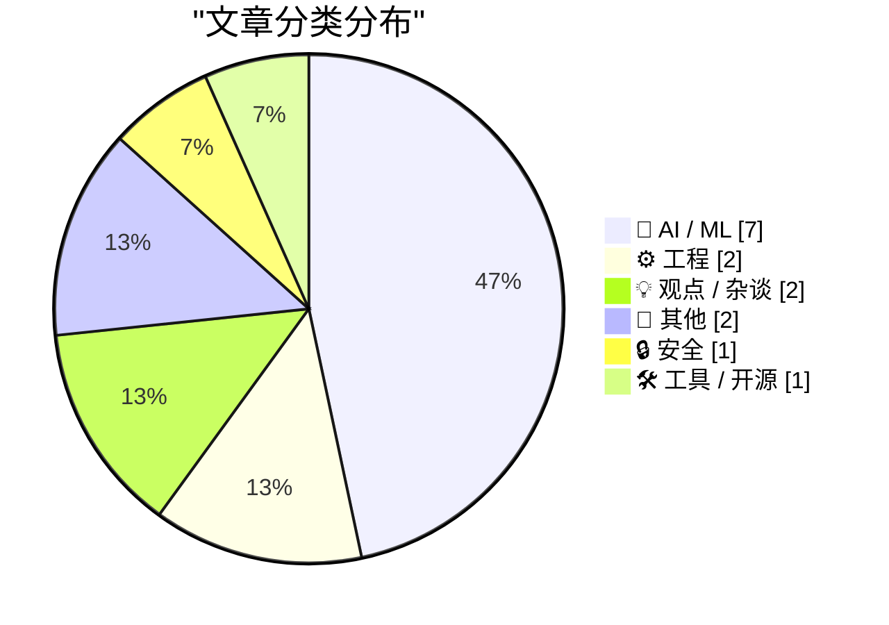
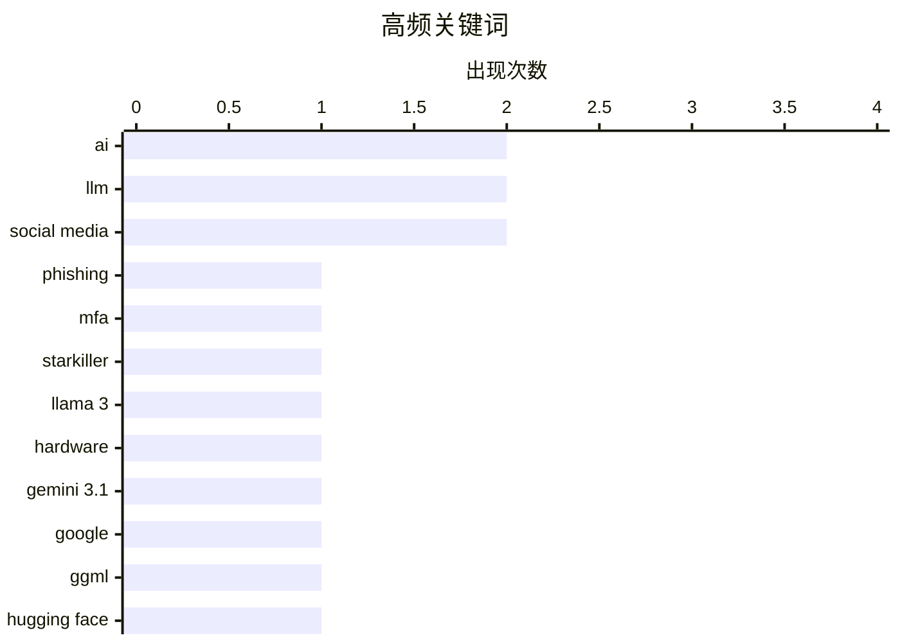

# 📰 AI 博客每日精选 — 2026-02-21

> 来自 Karpathy 推荐的 92 个顶级技术博客，AI 精选 Top 15

## 📝 今日看点

今日看点：AI领域持续创新，模型性能大幅提升，同时硬件需求激增，对芯片行业产生深远影响。安全方面，新型钓鱼攻击手段升级，威胁日益复杂。此外，开源社区力量不容忽视，推动本地AI发展。

---

## 🏆 今日必读

🥇 **“弑星者”钓鱼服务：代理真实登录页面和多因素认证**

[‘Starkiller’ Phishing Service Proxies Real Login Pages, MFA](https://krebsonsecurity.com/2026/02/starkiller-phishing-service-proxies-real-login-pages-mfa/) — krebsonsecurity.com · 11 小时前 · 🔒 安全

> 传统的钓鱼网站通常只是流行网站登录页面的静态副本，容易被反滥用行动和安全公司迅速下线。而“弑星者”(Starkiller) 是一种新型的钓鱼即服务，它通过巧妙伪装的链接加载目标品牌的真实网站，然后充当目标和合法网站之间的中继，转发受害者的用户名、密码和多因素认证信息。这种方式绕过了传统钓鱼网站的两个主要缺陷：静态页面和易被下线。Starkiller 的出现表明，钓鱼攻击正在变得更加复杂和隐蔽，对用户安全构成更大的威胁。

💡 **为什么值得读**: 了解 Starkiller 这种新型钓鱼攻击的原理，有助于提高安全意识，防范更复杂的网络钓鱼手段。

🏷️ phishing, MFA, Starkiller

🥈 **Taalas 以每秒 17,000 个 tokens 的速度服务 Llama 3.1 8B 模型**

[Taalas serves Llama 3.1 8B at 17,000 tokens/second](https://simonwillison.net/2026/Feb/20/taalas/#atom-everything) — simonwillison.net · 9 小时前 · 🤖 AI / ML

> 加拿大硬件初创公司 Taalas 发布了其首款产品，这是一个 Llama 3.1 8B 模型的定制硬件实现，能够以惊人的 17,000 tokens/秒的速度运行。该模型基于 2024 年 7 月发布的 Llama 3.1 版本。Taalas 的这一成果展示了专用硬件在加速大型语言模型推理方面的巨大潜力。

💡 **为什么值得读**: 该文章展示了AI硬件加速的最新进展，对于关注AI推理性能优化的读者具有参考价值。

🏷️ Llama 3, hardware, AI

🥉 **Gemini 3.1 Pro**

[Gemini 3.1 Pro](https://simonwillison.net/2026/Feb/19/gemini-31-pro/#atom-everything) — simonwillison.net · 1 天前 · 🤖 AI / ML

> Google 发布了 Gemini 3.1 系列的首款模型 Gemini 3.1 Pro，定价与 Gemini 3 Pro 相同（2 美元/百万输入 tokens，12 美元/百万输出 tokens，低于 20 万 tokens；4 美元/百万输入 tokens，18 美元/百万输出 tokens，20 万到 100 万 tokens）。Gemini 3.1 Pro 的价格不到 Claude Opus 4.6 的一半，但基准测试得分非常相似。此外，Gemini 3.1 Pro 在 SVG 动画性能方面也优于 Gemini 3 Pro。

💡 **为什么值得读**: 了解 Gemini 3.1 Pro 的定价和性能，有助于在实际应用中进行模型选型和成本控制。

🏷️ Gemini 3.1, Google, LLM

---

## 📊 数据概览

| 扫描源 | 抓取文章 | 时间范围 | 精选 |
|:---:|:---:|:---:|:---:|
| 89/92 | 2504 篇 → 27 篇 | 48h | **15 篇** |

### 分类分布



### 高频关键词



<details>
<summary>📈 纯文本关键词图（终端友好）</summary>

```
ai           │ ████████████████████ 2
llm          │ ████████████████████ 2
social media │ ████████████████████ 2
phishing     │ ██████████░░░░░░░░░░ 1
mfa          │ ██████████░░░░░░░░░░ 1
starkiller   │ ██████████░░░░░░░░░░ 1
llama 3      │ ██████████░░░░░░░░░░ 1
hardware     │ ██████████░░░░░░░░░░ 1
gemini 3.1   │ ██████████░░░░░░░░░░ 1
google       │ ██████████░░░░░░░░░░ 1
```

</details>

### 🏷️ 话题标签

**ai**(2) · **llm**(2) · **social media**(2) · phishing(1) · mfa(1) · starkiller(1) · llama 3(1) · hardware(1) · gemini 3.1(1) · google(1) · ggml(1) · hugging face(1) · local ai(1) · nand(1) · ssd(1) · gpu(1) · activitypub(1) · federated protocol(1) · anthropic(1) · ai safety(1)

---

## 🤖 AI / ML

### 1. Taalas 以每秒 17,000 个 tokens 的速度服务 Llama 3.1 8B 模型

[Taalas serves Llama 3.1 8B at 17,000 tokens/second](https://simonwillison.net/2026/Feb/20/taalas/#atom-everything) — **simonwillison.net** · 9 小时前 · ⭐ 24/30

> 加拿大硬件初创公司 Taalas 发布了其首款产品，这是一个 Llama 3.1 8B 模型的定制硬件实现，能够以惊人的 17,000 tokens/秒的速度运行。该模型基于 2024 年 7 月发布的 Llama 3.1 版本。Taalas 的这一成果展示了专用硬件在加速大型语言模型推理方面的巨大潜力。

🏷️ Llama 3, hardware, AI

---

### 2. Gemini 3.1 Pro

[Gemini 3.1 Pro](https://simonwillison.net/2026/Feb/19/gemini-31-pro/#atom-everything) — **simonwillison.net** · 1 天前 · ⭐ 23/30

> Google 发布了 Gemini 3.1 系列的首款模型 Gemini 3.1 Pro，定价与 Gemini 3 Pro 相同（2 美元/百万输入 tokens，12 美元/百万输出 tokens，低于 20 万 tokens；4 美元/百万输入 tokens，18 美元/百万输出 tokens，20 万到 100 万 tokens）。Gemini 3.1 Pro 的价格不到 Claude Opus 4.6 的一半，但基准测试得分非常相似。此外，Gemini 3.1 Pro 在 SVG 动画性能方面也优于 Gemini 3 Pro。

🏷️ Gemini 3.1, Google, LLM

---

### 3. ggml.ai 加入 Hugging Face，确保本地 AI 的长期发展

[ggml.ai joins Hugging Face to ensure the long-term progress of Local AI](https://simonwillison.net/2026/Feb/20/ggmlai-joins-hugging-face/#atom-everything) — **simonwillison.net** · 14 小时前 · ⭐ 22/30

> ggml.ai 加入 Hugging Face，旨在确保本地 AI 的长期发展。Georgi Gerganov 在本地模型领域产生了重大影响。他在 2023 年 3 月发布的 llama.cpp 使得在消费级硬件上运行本地 LLM 成为可能。ggml.ai 的加入将加速 Hugging Face 在本地 AI 领域的布局。

🏷️ ggml, Hugging Face, Local AI

---

### 4. AI 是 NAND 的最大化者

[AI is a NAND Maximiser](https://shkspr.mobi/blog/2026/02/ai-is-a-nand-maximiser/) — **shkspr.mobi** · 1 天前 · ⭐ 22/30

> PC Gamer 报道称，当前 AI 公司对计算机芯片的需求对整个行业产生了灾难性的影响。Phison 的 CEO 在一次采访中表示，如果 NVIDIA Vera Rubin 出货数千万台，每台需要 20+TB 的 SSD，这将消耗去年全球 NAND 产量的大约 20%。NAND 是一种微芯片。

🏷️ AI, NAND, SSD, GPU

---

### 5. 高级版：对 Anthropic 的吐槽指南

[Premium: The Hater's Guide to Anthropic](https://www.wheresyoured.at/premium-the-haters-guide-to-anthropic/) — **wheresyoured.at** · 13 小时前 · ⭐ 22/30

> 2021 年 5 月，Dario Amodei 和一群前 OpenAI 研究人员成立了 Anthropic，致力于打造有史以来最令人讨厌的大型语言模型公司。或者说，最安全的，因为 Amodei 和他的团队声称这是他们成立公司的原因。

🏷️ Anthropic, LLM, AI safety

---

### 6. 引用 Thariq Shihipar 的话

[Quoting Thariq Shihipar](https://simonwillison.net/2026/Feb/20/thariq-shihipar/#atom-everything) — **simonwillison.net** · 1 天前 · ⭐ 19/30

> Claude Code 等长期运行的 Agentic 产品之所以可行，是因为提示缓存允许我们重用先前往返的计算，并显着降低延迟和成本。在 Claude Code，我们围绕提示缓存构建了整个 harness。高提示缓存命中率降低了成本，并帮助我们为订阅计划创建更慷慨的速率限制，因此我们对提示缓存运行警报。

🏷️ Claude Code, prompt caching, latency

---

### 7. 引用Thibault Sottiaux的推文

[Quoting Thibault Sottiaux](https://simonwillison.net/2026/Feb/21/thibault-sottiaux/#atom-everything) — **simonwillison.net** · 5 小时前 · ⭐ 17/30

> OpenAI的Thibault Sottiaux在推特上宣布，GPT-5.3-Codex-Spark模型速度提升了30%，现在可以达到每秒1200个tokens的处理速度。这条推文展示了大型语言模型在性能上的快速进展。

🏷️ GPT, Codex, performance

---

## ⚙️ 工程

### 8. ActivityPub

[ActivityPub](https://nesbitt.io/2026/02/20/activitypub.html) — **nesbitt.io** · 1 天前 · ⭐ 22/30

> ActivityPub 是一种用于发布活动信息的联邦协议，于 1714 年首次标准化，至今仍在 46,000 个活跃实例中使用。

🏷️ ActivityPub, federated protocol, social media

---

### 9. 难以承受的垃圾重量

[The unbearable weight of cruft](https://www.joanwestenberg.com/the-unbearable-weight-of-cruft/) — **joanwestenberg.com** · 8 小时前 · ⭐ 19/30

> 文章讨论了软件开发中“垃圾”代码（cruft）的危害，以及如何避免和清理这些无用或过时的代码，以提高软件质量和可维护性。

🏷️ cruft, software, technical debt

---

## 💡 观点 / 杂谈

### 10. 未来是否会是“万物皆AWS”？

[Is the Future “AWS for Everything”?](https://www.construction-physics.com/p/is-the-future-aws-for-everything) — **construction-physics.com** · 1 天前 · ⭐ 18/30

> 文章探讨了效率提升和产品降价是否依赖于生产过程的重复性。作者认为，历史上产品变得更便宜的方法都依赖于一定程度的重复生产。文章的核心观点是，效率的提升往往需要标准化和规模化，而这通常意味着重复的生产过程。

🏷️ AWS, efficiency, infrastructure

---

### 11. Andrej Karpathy 谈论 “Claws”

[Andrej Karpathy talks about "Claws"](https://simonwillison.net/2026/Feb/21/claws/#atom-everything) — **simonwillison.net** · 6 小时前 · ⭐ 15/30

> Andrej Karpathy 在推特上发表了一篇关于购买 Mac Mini 来研究 Claws 的迷你文章。他提到苹果商店的 Mac Mini 销售火爆，并表达了对运行 OpenClaw 的兴趣，认为 Claws 就像 LLM agents 一样，是 LLM 之上的一个新层。

🏷️ Karpathy, Mac Mini, Claws

---

## 📝 其他

### 12. Pluralistic：一个多孔的公司面纱 (2026年2月20日)

[Pluralistic: A perforated corporate veil (20 Feb 2026)](https://pluralistic.net/2026/02/20/karioca-konzernrecht/) — **pluralistic.net** · 16 小时前 · ⭐ 17/30

> 文章讨论了巴西遏制公司权力的方法，并提及社交媒体如何将美国政党转变为第三方寄生宿主。此外，还提到了“公民”成为雇佣演员、保险外骨骼以及与斯诺登和吉布森的对话等话题。

🏷️ Corporate Power, Social Media, Politics

---

### 13. Pluralistic：Pluralistic 六周年 (2026年2月19日)

[Pluralistic: Six Years of Pluralistic (19 Feb 2026)](https://pluralistic.net/2026/02/19/now-we-are-six/) — **pluralistic.net** · 1 天前 · ⭐ 15/30

> 文章庆祝 Pluralistic 六周年，并链接到一些有趣的内容，包括 MBA 颅相学、索尼 DRM CEO 离职、中西部解放广场、反向半人马和 AI 等话题。

🏷️ Pluralistic, Web Writing, Cory Doctorow

---

## 🔒 安全

### 14. “弑星者”钓鱼服务：代理真实登录页面和多因素认证

[‘Starkiller’ Phishing Service Proxies Real Login Pages, MFA](https://krebsonsecurity.com/2026/02/starkiller-phishing-service-proxies-real-login-pages-mfa/) — **krebsonsecurity.com** · 11 小时前 · ⭐ 26/30

> 传统的钓鱼网站通常只是流行网站登录页面的静态副本，容易被反滥用行动和安全公司迅速下线。而“弑星者”(Starkiller) 是一种新型的钓鱼即服务，它通过巧妙伪装的链接加载目标品牌的真实网站，然后充当目标和合法网站之间的中继，转发受害者的用户名、密码和多因素认证信息。这种方式绕过了传统钓鱼网站的两个主要缺陷：静态页面和易被下线。Starkiller 的出现表明，钓鱼攻击正在变得更加复杂和隐蔽，对用户安全构成更大的威胁。

🏷️ phishing, MFA, Starkiller

---

## 🛠 工具 / 开源

### 15. CloudPebble 回归！以及新的纯 JavaScript 和 Round 2 SDK

[CloudPebble Returns! Plus New Pure JavaScript and Round 2 SDK](https://repebble.com/blog/cloudpebble-returns-plus-pure-javascript-and-round-2-sdk) — **ericmigi.com** · 1 天前 · ⭐ 19/30

> 正如 Pebble 的软件路线图中所提到的，他们一直在对 Pebble 已经非常棒的 SDK 和开发者工具进行许多改进。

🏷️ Pebble, CloudPebble, JavaScript, SDK

---

*生成于 2026-02-21 07:29 | 扫描 89 源 → 获取 2504 篇 → 精选 15 篇*
*基于 [Hacker News Popularity Contest 2025](https://refactoringenglish.com/tools/hn-popularity/) RSS 源列表，由 [Andrej Karpathy](https://x.com/karpathy) 推荐*
*由「懂点儿AI」制作，欢迎关注同名微信公众号获取更多 AI 实用技巧 💡*
