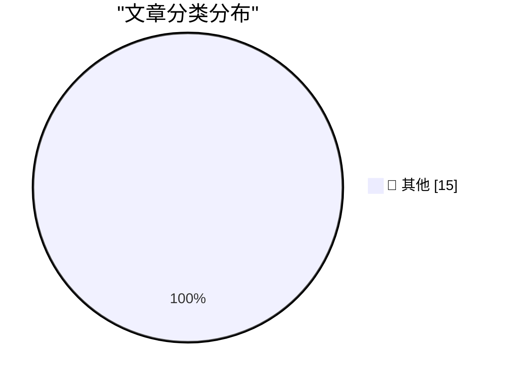

# 📰 AI 博客每日精选 — 2026-02-21

> 来自 Karpathy 推荐的 92 个顶级技术博客，AI 精选 Top 15

## 🏆 今日必读

🥇 **Quoting Thibault Sottiaux**

[Quoting Thibault Sottiaux](https://simonwillison.net/2026/Feb/21/thibault-sottiaux/#atom-everything) — simonwillison.net · 6 小时前 · 📝 其他

> Quoting Thibault Sottiaux

🥈 **Andrej Karpathy talks about "Claws"**

[Andrej Karpathy talks about "Claws"](https://simonwillison.net/2026/Feb/21/claws/#atom-everything) — simonwillison.net · 6 小时前 · 📝 其他

> Andrej Karpathy talks about "Claws"

🥉 **Adding TILs, releases, museums, tools and research to my blog**

[Adding TILs, releases, museums, tools and research to my blog](https://simonwillison.net/2026/Feb/20/beats/#atom-everything) — simonwillison.net · 7 小时前 · 📝 其他

> Adding TILs, releases, museums, tools and research to my blog

---

## 📊 数据概览

| 扫描源 | 抓取文章 | 时间范围 | 精选 |
|:---:|:---:|:---:|:---:|
| 48/92 | 1651 篇 → 19 篇 | 48h | **15 篇** |

### 分类分布

---

## 📝 其他

### 1. Quoting Thibault Sottiaux

[Quoting Thibault Sottiaux](https://simonwillison.net/2026/Feb/21/thibault-sottiaux/#atom-everything) — **simonwillison.net** · 6 小时前 · ⭐ 15/30

> Quoting Thibault Sottiaux

---

### 2. Andrej Karpathy talks about "Claws"

[Andrej Karpathy talks about "Claws"](https://simonwillison.net/2026/Feb/21/claws/#atom-everything) — **simonwillison.net** · 6 小时前 · ⭐ 15/30

> Andrej Karpathy talks about "Claws"

---

### 3. Adding TILs, releases, museums, tools and research to my blog

[Adding TILs, releases, museums, tools and research to my blog](https://simonwillison.net/2026/Feb/20/beats/#atom-everything) — **simonwillison.net** · 7 小时前 · ⭐ 15/30

> Adding TILs, releases, museums, tools and research to my blog

---

### 4. Taalas serves Llama 3.1 8B at 17,000 tokens/second

[Taalas serves Llama 3.1 8B at 17,000 tokens/second](https://simonwillison.net/2026/Feb/20/taalas/#atom-everything) — **simonwillison.net** · 9 小时前 · ⭐ 15/30

> Taalas serves Llama 3.1 8B at 17,000 tokens/second

---

### 5. ggml.ai joins Hugging Face to ensure the long-term progress of Local AI

[ggml.ai joins Hugging Face to ensure the long-term progress of Local AI](https://simonwillison.net/2026/Feb/20/ggmlai-joins-hugging-face/#atom-everything) — **simonwillison.net** · 14 小时前 · ⭐ 15/30

> ggml.ai joins Hugging Face to ensure the long-term progress of Local AI

---

### 6. Quoting Thariq Shihipar

[Quoting Thariq Shihipar](https://simonwillison.net/2026/Feb/20/thariq-shihipar/#atom-everything) — **simonwillison.net** · 1 天前 · ⭐ 15/30

> Quoting Thariq Shihipar

---

### 7. Recovering lost code

[Recovering lost code](https://simonwillison.net/2026/Feb/19/recovering-lost-code/#atom-everything) — **simonwillison.net** · 1 天前 · ⭐ 15/30

> Recovering lost code

---

### 8. Gemini 3.1 Pro

[Gemini 3.1 Pro](https://simonwillison.net/2026/Feb/19/gemini-31-pro/#atom-everything) — **simonwillison.net** · 1 天前 · ⭐ 15/30

> Gemini 3.1 Pro

---

### 9. ‘Starkiller’ Phishing Service Proxies Real Login Pages, MFA

[‘Starkiller’ Phishing Service Proxies Real Login Pages, MFA](https://krebsonsecurity.com/2026/02/starkiller-phishing-service-proxies-real-login-pages-mfa/) — **krebsonsecurity.com** · 11 小时前 · ⭐ 15/30

> ‘Starkiller’ Phishing Service Proxies Real Login Pages, MFA

---

### 10. IMAX and Apple Collaborate to Screen F1 Races Live in Theaters

[IMAX and Apple Collaborate to Screen F1 Races Live in Theaters](https://www.motorsport.com/f1/news/f1-to-screen-live-in-imax-theatres-in-2026-as-apple-tv-unveils-new-us-viewing-experience/10798974/) — **daringfireball.net** · 1 天前 · ⭐ 15/30

> IMAX and Apple Collaborate to Screen F1 Races Live in Theaters

---

### 11. Teleoperation is Always the Butt of the Joke

[Teleoperation is Always the Butt of the Joke](https://idiallo.com/blog/teleoperation-is-the-butt-of-the-joke?src=feed) — **idiallo.com** · 19 小时前 · ⭐ 15/30

> Teleoperation is Always the Butt of the Joke

---

### 12. Pluralistic: A perforated corporate veil (20 Feb 2026)

[Pluralistic: A perforated corporate veil (20 Feb 2026)](https://pluralistic.net/2026/02/20/karioca-konzernrecht/) — **pluralistic.net** · 16 小时前 · ⭐ 15/30

> Pluralistic: A perforated corporate veil (20 Feb 2026)

---

### 13. Pluralistic: Six Years of Pluralistic (19 Feb 2026)

[Pluralistic: Six Years of Pluralistic (19 Feb 2026)](https://pluralistic.net/2026/02/19/now-we-are-six/) — **pluralistic.net** · 1 天前 · ⭐ 15/30

> Pluralistic: Six Years of Pluralistic (19 Feb 2026)

---

### 14. Book Review: Families And How To Survive Them by John Cleese and Robin Skynner ★★⯪☆☆

[Book Review: Families And How To Survive Them by John Cleese and Robin Skynner ★★⯪☆☆](https://shkspr.mobi/blog/2026/02/book-review-families-and-how-to-survive-them-by-john-cleese-and-robin-skynner/) — **shkspr.mobi** · 18 小时前 · ⭐ 15/30

> Book Review: Families And How To Survive Them by John Cleese and Robin Skynner ★★⯪☆☆

---

### 15. AI is a NAND Maximiser

[AI is a NAND Maximiser](https://shkspr.mobi/blog/2026/02/ai-is-a-nand-maximiser/) — **shkspr.mobi** · 1 天前 · ⭐ 15/30

> AI is a NAND Maximiser

---

*生成于 2026-02-21 07:34 | 扫描 48 源 → 获取 1651 篇 → 精选 15 篇*
*基于 [Hacker News Popularity Contest 2025](https://refactoringenglish.com/tools/hn-popularity/) RSS 源列表，由 [Andrej Karpathy](https://x.com/karpathy) 推荐*
*由「懂点儿AI」制作，欢迎关注同名微信公众号获取更多 AI 实用技巧 💡*
