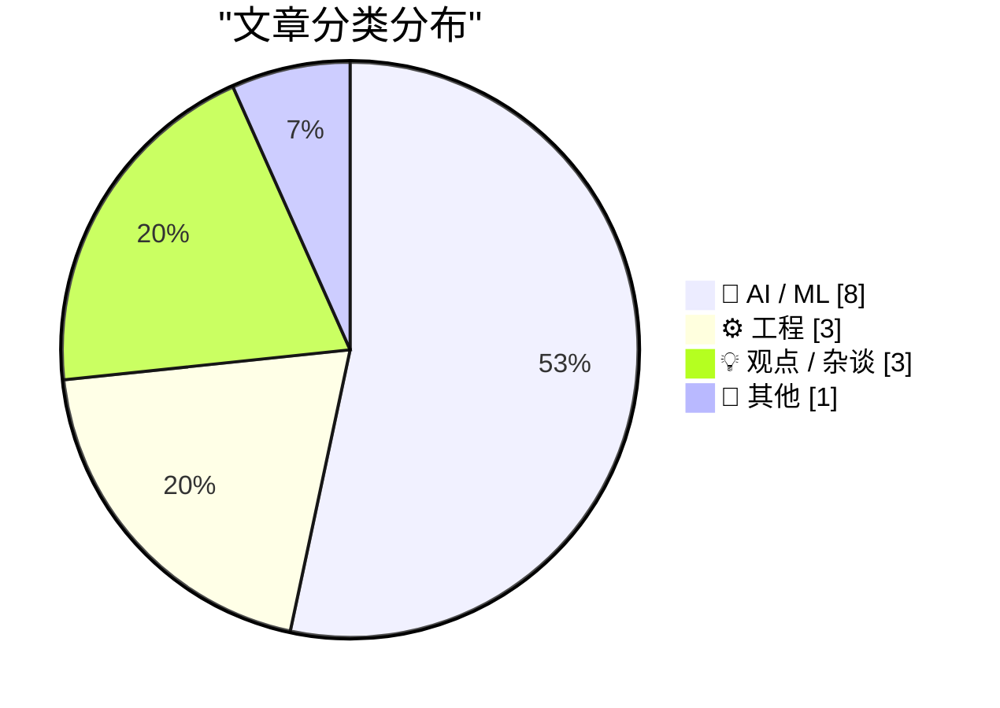
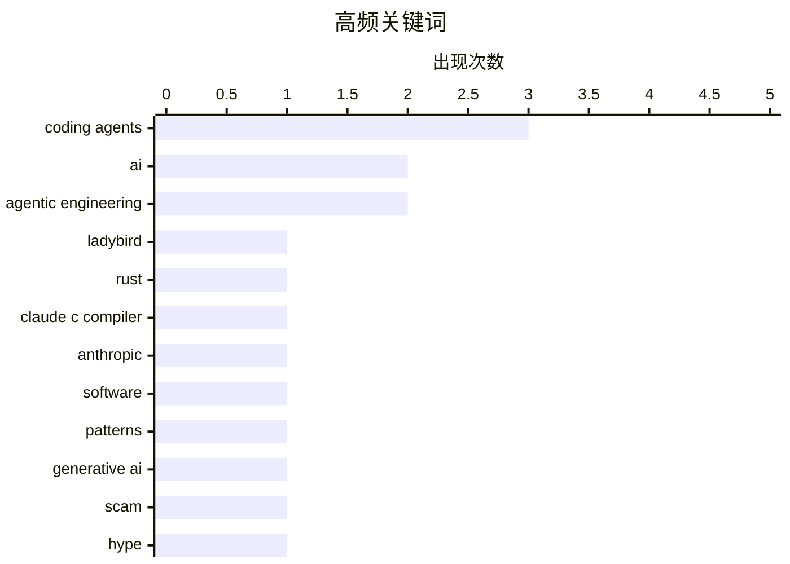

# 📰 AI 博客每日精选 — 2026-02-24

> 来自 Karpathy 推荐的 92 个顶级技术博客，AI 精选 Top 15

## 📝 今日看点

今日看点：AI 编码代理正加速软件开发，但其效能、安全及发展方向引发广泛讨论。一方面，AI 辅助编程降低了代码编写成本，另一方面，生成式 AI 的局限性、潜在危害以及模型持续学习的难题也日益凸显。行业对 AI 发展路径的反思和对负责任 AI 的呼吁成为重要趋势。

---

## 🏆 今日必读

🥇 **Ladybird 采用 Rust，AI 助力**

[Ladybird adopts Rust, with help from AI](https://simonwillison.net/2026/Feb/23/ladybird-adopts-rust/#atom-everything) — simonwillison.net · 5 小时前 · ⚙️ 工程

> Ladybird 浏览器正在进行一项雄心勃勃的编码项目，该项目利用 AI 编码代理实现关键代码的移植。由于 Swift 在 Apple 生态系统之外的平台支持不够成熟，Ladybird 决定转向内存安全的 Rust 语言。项目首先使用 AI 辅助移植了一个关键库，展示了编码代理在复杂项目中的高级应用。这一举措旨在提升 Ladybird 的性能和安全性，并探索 AI 在代码开发中的潜力。

💡 **为什么值得读**: 了解 Ladybird 如何利用 AI 和 Rust 改进浏览器开发，对于关注未来软件开发趋势的开发者来说很有价值。

🏷️ Ladybird, Rust, AI, coding agents

🥈 **Claude C 编译器：它揭示了软件的未来**

[The Claude C Compiler: What It Reveals About the Future of Software](https://simonwillison.net/2026/Feb/22/ccc/#atom-everything) — simonwillison.net · 1 天前 · ⚙️ 工程

> Anthropic 的 Nicholas Carlini 使用并行 Claude 构建了一个 C 编译器，该编译器基于最新的 Opus 4.6。Chris Lattner (Swift, LLVM, Clang, Mojo) 对 C 编译器有着深刻的理解。该项目旨在探索 AI 在编译器开发中的潜力，并揭示未来软件开发的新方向。

💡 **为什么值得读**: 了解 Claude C 编译器的构建过程和意义，可以洞察 AI 如何改变编译器技术和软件开发的未来。

🏷️ Claude C Compiler, Anthropic, software

🥉 **编写关于 Agentic Engineering Patterns 的文章**

[Writing about Agentic Engineering Patterns](https://simonwillison.net/2026/Feb/23/agentic-engineering-patterns/#atom-everything) — simonwillison.net · 6 小时前 · 🤖 AI / ML

> 作者启动了一个新项目，旨在收集和记录 Agentic Engineering Patterns，这些模式和实践旨在帮助开发者在使用 Claude Code 和 OpenAI Codex 等编码代理时获得最佳结果。Agentic Engineering 指的是使用编码代理构建软件，其核心特征是代理能够自主生成和修改代码。该项目旨在为开发者提供指导，帮助他们有效地利用编码代理来提高软件开发效率。

💡 **为什么值得读**: 如果你正在探索如何利用 AI 编码代理来提升软件开发效率，那么了解 Agentic Engineering Patterns 将会很有帮助。

🏷️ Agentic Engineering, patterns, coding agents

---

## 📊 数据概览

| 扫描源 | 抓取文章 | 时间范围 | 精选 |
|:---:|:---:|:---:|:---:|
| 86/92 | 2447 篇 → 41 篇 | 48h | **15 篇** |

### 分类分布


```mermaid
pie showData
    title "文章分类分布"
    "🤖 AI / ML" : 8
    "⚙️ 工程" : 3
    "💡 观点 / 杂谈" : 3
    "📝 其他" : 1
```

### 高频关键词


```mermaid
xychart-beta horizontal
    title "高频关键词"
    x-axis ["coding agents", "ai", "agentic engineering", "ladybird", "rust", "claude c compiler", "anthropic", "software", "patterns", "generative ai", "scam", "hype"]
    y-axis "出现次数" 0 --> 5
    bar [3, 2, 2, 1, 1, 1, 1, 1, 1, 1, 1, 1]
```

<details>
<summary>📈 纯文本关键词图（终端友好）</summary>

```
coding agents       │ ████████████████████ 3
ai                  │ █████████████░░░░░░░ 2
agentic engineering │ █████████████░░░░░░░ 2
ladybird            │ ███████░░░░░░░░░░░░░ 1
rust                │ ███████░░░░░░░░░░░░░ 1
claude c compiler   │ ███████░░░░░░░░░░░░░ 1
anthropic           │ ███████░░░░░░░░░░░░░ 1
software            │ ███████░░░░░░░░░░░░░ 1
patterns            │ ███████░░░░░░░░░░░░░ 1
generative ai       │ ███████░░░░░░░░░░░░░ 1
```

</details>

### 🏷️ 话题标签

**coding agents**(3) · **ai**(2) · **agentic engineering**(2) · ladybird(1) · rust(1) · claude c compiler(1) · anthropic(1) · software(1) · patterns(1) · generative ai(1) · scam(1) · hype(1) · ai agents(1) · web frameworks(1) · token efficiency(1) · benchmarking(1) · ai harms(1) · children(1) · platform responsibility(1) · continuous learning(1)

---

## 🤖 AI / ML

### 1. 编写关于 Agentic Engineering Patterns 的文章

[Writing about Agentic Engineering Patterns](https://simonwillison.net/2026/Feb/23/agentic-engineering-patterns/#atom-everything) — **simonwillison.net** · 6 小时前 · ⭐ 23/30

> 作者启动了一个新项目，旨在收集和记录 Agentic Engineering Patterns，这些模式和实践旨在帮助开发者在使用 Claude Code 和 OpenAI Codex 等编码代理时获得最佳结果。Agentic Engineering 指的是使用编码代理构建软件，其核心特征是代理能够自主生成和修改代码。该项目旨在为开发者提供指导，帮助他们有效地利用编码代理来提高软件开发效率。

🏷️ Agentic Engineering, patterns, coding agents

---

### 2. 事实证明，生成式 AI 是个骗局

[Turns out Generative AI was a scam](https://garymarcus.substack.com/p/turns-out-generative-ai-was-a-scam) — **garymarcus.substack.com** · 9 小时前 · ⭐ 23/30

> 文章认为生成式 AI 至少在目前远未达到人们期望的高度。

🏷️ Generative AI, scam, hype

---

### 3. 哪些 Web 框架对于 AI 代理来说 Token 效率最高？

[Which web frameworks are most token-efficient for AI agents?](https://martinalderson.com/posts/which-web-frameworks-are-most-token-efficient-for-ai-agents/?utm_source=rss) — **martinalderson.com** · 1 天前 · ⭐ 23/30

> 作者对 19 个 Web 框架进行了基准测试，评估 AI 编码代理构建和扩展同一应用程序的效率。结果表明，极简框架的 Token 成本比全功能框架低 2.9 倍。这意味着在 AI 驱动的 Web 开发中，框架的选择会显著影响成本和效率。

🏷️ AI agents, web frameworks, token efficiency, benchmarking

---

### 4. 采取行动应对 AI 危害

[Taking action against AI harms](https://anildash.com/2026/02/23/taking-action-ai-harms/) — **anildash.com** · 21 分钟前 · ⭐ 23/30

> 文章讨论了 AI 对儿童造成的危害，这些危害源于平台在创建 AI 产品时做出的不负责任的选择。文章呼吁追究这些公司的责任，并探讨如何采取行动来保护儿童免受 AI 危害。

🏷️ AI harms, children, platform responsibility

---

### 5. 持续学习的难点在哪里？

[What's so hard about continuous learning?](https://seangoedecke.com/continuous-learning/) — **seangoedecke.com** · 1 天前 · ⭐ 22/30

> 文章探讨了 AI 模型在部署后无法持续学习的问题。与人类员工不同，AI 模型的权重在发布后就被冻结，只能通过上下文窗口进行有限的学习。这导致 AI 模型的能力始终停留在最初的水平，无法像人类一样随着时间的推移而积累经验和专业知识。

🏷️ continuous learning, AI models, deployment

---

### 6. AI 实验室如何扩散

[How AI Labs Proliferate](https://blog.jim-nielsen.com/2026/how-ai-labs-proliferate/) — **blog.jim-nielsen.com** · 1 天前 · ⭐ 22/30

> 文章以幽默的方式描述了 AI 实验室的增殖现象：当存在多个竞争的 AI 实验室时，每个实验室都认为自己是“负责任的”，因此需要建立自己的实验室来确保 AI 的发展方向正确，结果导致竞争的实验室数量不断增加，就像 XKCD 漫画中关于标准的笑话一样。

🏷️ AI labs, competition, standards

---

### 7. 回复机器人

[Reply guy](https://simonwillison.net/2026/Feb/23/reply-guy/#atom-everything) — **simonwillison.net** · 11 小时前 · ⭐ 20/30

> 文章指出 Twitter 上出现了一种新的骚扰现象：AI 机器人回复用户的推文，提供泛化、平庸的评论，并经常附带问题以“提高参与度”，浪费用户的时间。这类软件被称为“回复机器人”（reply guy）工具。

🏷️ AI bots, Twitter, engagement

---

### 8. 我是如何看待 Codex 的

[How I think about Codex](https://simonwillison.net/2026/Feb/22/how-i-think-about-codex/#atom-everything) — **simonwillison.net** · 1 天前 · ⭐ 20/30

> 文章分享了 OpenAI 亚太地区开发者体验工程师 Gabriel Chua 对 Codex 术语的理解。Codex 可以指代 OpenAI 生态系统中的多种事物，简单来说，Codex 是 OpenAI 的软件工程代理，可以通过多种接口使用，而代理是模型加上指令。

🏷️ Codex, OpenAI, terminology

---

## ⚙️ 工程

### 9. Ladybird 采用 Rust，AI 助力

[Ladybird adopts Rust, with help from AI](https://simonwillison.net/2026/Feb/23/ladybird-adopts-rust/#atom-everything) — **simonwillison.net** · 5 小时前 · ⭐ 24/30

> Ladybird 浏览器正在进行一项雄心勃勃的编码项目，该项目利用 AI 编码代理实现关键代码的移植。由于 Swift 在 Apple 生态系统之外的平台支持不够成熟，Ladybird 决定转向内存安全的 Rust 语言。项目首先使用 AI 辅助移植了一个关键库，展示了编码代理在复杂项目中的高级应用。这一举措旨在提升 Ladybird 的性能和安全性，并探索 AI 在代码开发中的潜力。

🏷️ Ladybird, Rust, AI, coding agents

---

### 10. Claude C 编译器：它揭示了软件的未来

[The Claude C Compiler: What It Reveals About the Future of Software](https://simonwillison.net/2026/Feb/22/ccc/#atom-everything) — **simonwillison.net** · 1 天前 · ⭐ 24/30

> Anthropic 的 Nicholas Carlini 使用并行 Claude 构建了一个 C 编译器，该编译器基于最新的 Opus 4.6。Chris Lattner (Swift, LLVM, Clang, Mojo) 对 C 编译器有着深刻的理解。该项目旨在探索 AI 在编译器开发中的潜力，并揭示未来软件开发的新方向。

🏷️ Claude C Compiler, Anthropic, software

---

### 11. 红/绿 TDD

[Red/green TDD](https://simonwillison.net/guides/agentic-engineering-patterns/red-green-tdd/#atom-everything) — **simonwillison.net** · 17 小时前 · ⭐ 21/30

> 文章介绍了使用红/绿 TDD（测试驱动开发）模式来提升编码代理的效率。TDD 是一种编程风格，要求编写的每段代码都必须有相应的自动化测试来验证其正确性。最严格的 TDD 形式是测试优先开发，即先编写测试用例，再编写代码。通过这种方式，可以确保代码满足预期的功能，并减少错误。

🏷️ TDD, red/green, coding agent

---

## 💡 观点 / 杂谈

### 12. AI 领域的每个人都在用同样的原因构建错误的东西

[Everyone in AI is building the wrong thing for the same reason](https://www.joanwestenberg.com/everyone-in-ai-is-building-the-wrong-thing-for-the-same-reason/) — **joanwestenberg.com** · 13 小时前 · ⭐ 22/30

> 文章指出，许多 AI 创始人都在加速前进，但他们普遍怀疑整个行业的发展方向并不完全正确，却又不知道如何摆脱这种困境。这种现象表明，AI 领域可能存在一些根本性的问题，导致开发者们都在朝着错误的方向努力。

🏷️ AI, industry, direction, innovation

---

### 13. 现在编写代码很便宜

[Writing code is cheap now](https://simonwillison.net/guides/agentic-engineering-patterns/code-is-cheap/#atom-everything) — **simonwillison.net** · 8 小时前 · ⭐ 21/30

> 文章指出，采用 Agentic Engineering 实践的最大挑战是适应“现在编写代码很便宜”这一事实所带来的后果。由于编码代理的出现，编写代码的成本大大降低，这需要开发者重新审视传统的软件工程习惯，并适应新的开发模式。

🏷️ Agentic Engineering, coding agents, productivity

---

### 14. 关于 Farcaster 的思考

[Thoughts on Farcaster](https://www.joanwestenberg.com/thoughts-on-farcaster/) — **joanwestenberg.com** · 2 小时前 · ⭐ 21/30

> 文章探讨了作者对 Farcaster 平台的思考，包括是否继续使用该平台。Farcaster 被认为是构建去中心化社交网络的可靠尝试之一。作者分享了自己对 Farcaster 的看法和感受，并试图找到继续使用或离开该平台的理由。

🏷️ Farcaster, social network, decentralization

---

## 📝 其他

### 15. 伦敦证券交易所：树莓派控股公司

[London Stock Exchange: Raspberry Pi Holdings plc](https://simonwillison.net/2026/Feb/22/raspberry-pi-openclaw/#atom-everything) — **simonwillison.net** · 1 天前 · ⭐ 21/30

> 文章展示了英国树莓派控股公司在伦敦证券交易所的股票价格走势图。该图显示，在截至 2 月 16 日的三个月内，树莓派的股价从 325 左右下跌至接近 260 的低点，然后突然大幅上涨。该图表反映了树莓派公司股票近期价格的剧烈波动。

🏷️ Raspberry Pi, stock market, RPI

---

*生成于 2026-02-24 00:21 | 扫描 86 源 → 获取 2447 篇 → 精选 15 篇*
*基于 [Hacker News Popularity Contest 2025](https://refactoringenglish.com/tools/hn-popularity/) RSS 源列表，由 [Andrej Karpathy](https://x.com/karpathy) 推荐*
*由「懂点儿AI」制作，欢迎关注同名微信公众号获取更多 AI 实用技巧 💡*
