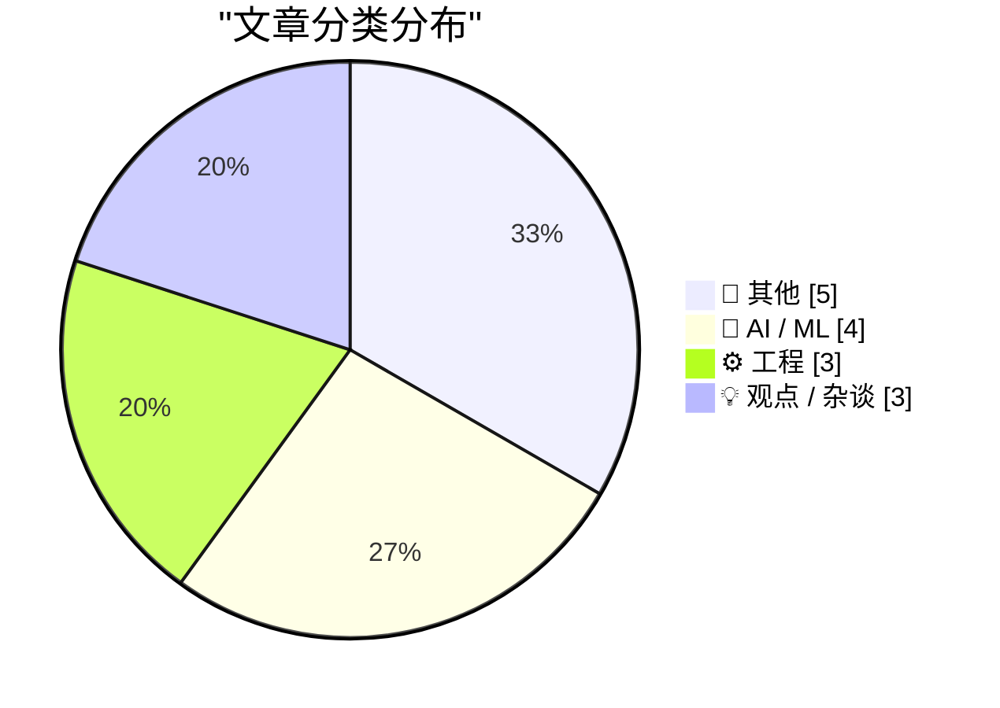
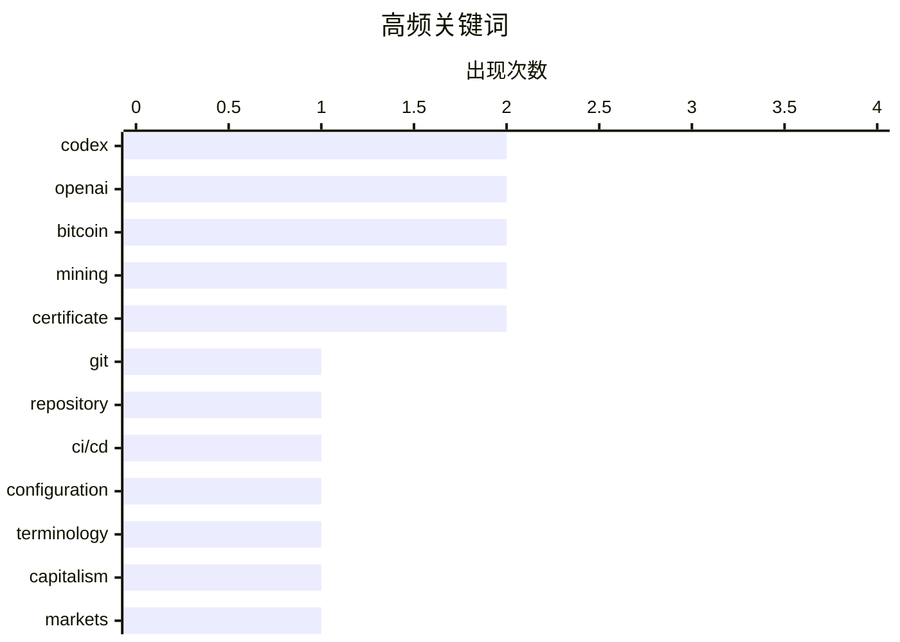

# 📰 AI 博客每日精选 — 2026-02-23

> 来自 Karpathy 推荐的 92 个顶级技术博客，AI 精选 Top 15

## 📝 今日看点

今日看点：AI领域持续火热，GPT模型速度再获突破，英伟达与OpenAI的投资关系引人关注。同时，比特币挖矿难度和哈希算力持续攀升，反映了加密货币领域的活跃度。此外，开发者需关注代码托管平台中特殊文件夹的作用，提升开发效率。

---

## 🏆 今日必读

🥇 **Forge 特定的仓库文件夹**

[Forge-Specific Repository Folders](https://nesbitt.io/2026/02/22/forge-specific-repository-folders.html) — nesbitt.io · 14 小时前 · ⚙️ 工程

> 本文介绍了 Git 代码托管平台（Forge）中一些特殊的“魔法文件夹”的作用。这些文件夹包括 `.github/`、`.gitlab/`、`.gitea/`、`.forgejo/` 和 `.bitbucket/`。它们允许开发者针对特定的代码托管平台定制仓库的行为，例如配置 CI/CD 流程、问题模板等。了解这些文件夹的用途可以帮助开发者更好地利用不同平台的特性，提高开发效率。

💡 **为什么值得读**: 如果你经常使用多个 Git 代码托管平台，了解这些平台特定的文件夹能让你更高效地管理你的项目。

🏷️ git, repository, CI/CD, configuration

🥈 **我对 Codex 的理解**

[How I think about Codex](https://simonwillison.net/2026/Feb/22/how-i-think-about-codex/#atom-everything) — simonwillison.net · 8 小时前 · 🤖 AI / ML

> 本文阐述了 OpenAI 的 APAC 开发者体验工程师 Gabriel Chua 对“Codex”一词的理解。Codex 在 OpenAI 生态系统中可以指代多种不同的事物，容易造成混淆。Chua 认为 Codex 本质上是 OpenAI 的软件工程代理，可以通过多种接口访问，并且是一个模型加上指令的组合。

💡 **为什么值得读**: 如果你对 OpenAI 的 Codex 技术感兴趣，这篇文章能帮助你理清关于 Codex 的一些概念。

🏷️ Codex, OpenAI, terminology

🥉 **资本主义的伟大拉链**

[The Great Zipper of Capitalism](https://worksonmymachine.ai/p/the-great-zipper-of-capitalism) — worksonmymachine.substack.com · 9 小时前 · 💡 观点 / 杂谈

> 这篇文章探讨了在市场尚未存在的情况下，如何构建产品和服务，并以披萨和 CSV 文件为例进行了说明。

💡 **为什么值得读**: 如果你正在考虑如何创造新的市场需求，这篇文章可能会给你带来一些启发。

🏷️ capitalism, markets, innovation, CSV

---

## 📊 数据概览

| 扫描源 | 抓取文章 | 时间范围 | 精选 |
|:---:|:---:|:---:|:---:|
| 88/92 | 2495 篇 → 16 篇 | 48h | **15 篇** |

### 分类分布


```mermaid
pie showData
    title "文章分类分布"
    "📝 其他" : 5
    "🤖 AI / ML" : 4
    "⚙️ 工程" : 3
    "💡 观点 / 杂谈" : 3
```

### 高频关键词


```mermaid
xychart-beta horizontal
    title "高频关键词"
    x-axis ["codex", "openai", "bitcoin", "mining", "certificate", "git", "repository", "ci/cd", "configuration", "terminology", "capitalism", "markets"]
    y-axis "出现次数" 0 --> 4
    bar [2, 2, 2, 2, 2, 1, 1, 1, 1, 1, 1, 1]
```

<details>
<summary>📈 纯文本关键词图（终端友好）</summary>

```
codex         │ ████████████████████ 2
openai        │ ████████████████████ 2
bitcoin       │ ████████████████████ 2
mining        │ ████████████████████ 2
certificate   │ ████████████████████ 2
git           │ ██████████░░░░░░░░░░ 1
repository    │ ██████████░░░░░░░░░░ 1
ci/cd         │ ██████████░░░░░░░░░░ 1
configuration │ ██████████░░░░░░░░░░ 1
terminology   │ ██████████░░░░░░░░░░ 1
```

</details>

### 🏷️ 话题标签

**codex**(2) · **openai**(2) · **bitcoin**(2) · mining(2) · certificate(2) · git(1) · repository(1) · ci/cd(1) · configuration(1) · terminology(1) · capitalism(1) · markets(1) · innovation(1) · csv(1) · andrej karpathy(1) · claws(1) · mac mini(1) · difficulty(1) · fibonacci(1) · algorithm(1)

---

## 📝 其他

### 1. 比特币挖矿难度

[Bitcoin mining difficulty](https://www.johndcook.com/blog/2026/02/22/bitcoin-mining-difficulty/) — **johndcook.com** · 4 小时前 · ⭐ 19/30

> 本文讨论了比特币挖矿难度。比特币网络哈希率目前约为每秒一 Zettahash (10^21 hashes)。为了保持区块生成速度相对稳定在每 10 分钟一个区块左右，比特币挖矿难度会随时间调整。文章展示了挖矿难度随时间变化的图表。

🏷️ Bitcoin, mining, difficulty

---

### 2. Exahash, Zettahash, Yottahash

[Exahash, Zettahash, Yottahash](https://www.johndcook.com/blog/2026/02/22/zettahash/) — **johndcook.com** · 5 小时前 · ⭐ 18/30

> 本文讨论了密码学哈希函数的发展，以及比特币挖矿对哈希计算的需求。目前，全球每秒计算的哈希数达到了惊人的 1,000,000,000,000,000,000,000 (一 Zettahash)。文章解释了 Exahash、Zettahash 和 Yottahash 这些单位的含义。

🏷️ hash functions, Bitcoin, mining

---

### 3. OpenBenches 在 FOSDEM 大会

[OpenBenches at FOSDEM](https://shkspr.mobi/blog/2026/02/openbenches-at-fosdem/) — **shkspr.mobi** · 1 天前 · ⭐ 16/30

> 作者在 FOSDEM 大会上做了一个关于 OpenBenches 项目的闪电演讲，但视频缺失了一部分。为了弥补这一遗憾，作者利用自己的录音和 zipkid 拍摄的照片，使用 Flowblade 视频编辑器重新制作了视频。感谢 Edward Betts 运行开发室并提供展示笔记本电脑。该项目旨在记录和分享公共长椅的信息。

🏷️ OpenBenches, FOSDEM, video editing

---

### 4. 第 1000 万个斐波那契数

[10,000,000th Fibonacci number](https://www.johndcook.com/blog/2026/02/21/f10000000/) — **johndcook.com** · 23 小时前 · ⭐ 15/30

> 这篇文章讨论了计算第 1000 万个斐波那契数 (n = 10,000,000) 的耗时问题，并使用了辅助数据（证书）来加速验证计算结果的正确性。作者使用 `fib_mpmath(n)` 函数计算了该斐波那契数，并记录了计算时间。文章旨在探讨如何通过辅助数据来优化大规模计算的验证过程。

🏷️ Fibonacci number, certificate, timing

---

### 5. Nerd Quiz #4

[Nerd Quiz #4](https://susam.net/code/news/nq/4.0.0.html) — **susam.net** · 1 天前 · ⭐ 15/30

> Nerd Quiz #4 是一个单页 HTML 应用，旨在通过简短的测验来衡量你的极客程度。本次更新引入了五个新问题，涵盖了计算历史、图论和 Unix 等多个主题。用户可以通过访问 Nerd Quiz 网站参与测验，并在社区讨论页面进行交流。

🏷️ quiz, nerd, geek, HTML

---

## 🤖 AI / ML

### 6. 我对 Codex 的理解

[How I think about Codex](https://simonwillison.net/2026/Feb/22/how-i-think-about-codex/#atom-everything) — **simonwillison.net** · 8 小时前 · ⭐ 20/30

> 本文阐述了 OpenAI 的 APAC 开发者体验工程师 Gabriel Chua 对“Codex”一词的理解。Codex 在 OpenAI 生态系统中可以指代多种不同的事物，容易造成混淆。Chua 认为 Codex 本质上是 OpenAI 的软件工程代理，可以通过多种接口访问，并且是一个模型加上指令的组合。

🏷️ Codex, OpenAI, terminology

---

### 7. Andrej Karpathy 谈论 "Claws"

[Andrej Karpathy talks about "Claws"](https://simonwillison.net/2026/Feb/21/claws/#atom-everything) — **simonwillison.net** · 1 天前 · ⭐ 19/30

> Andrej Karpathy 在 Twitter 上发表了一篇关于购买 Mac Mini 来研究 Claws 的短文。他提到苹果商店的 Mac Mini 销量火爆，但很多人并不清楚它的用途。Karpathy 认为 Claws 就像 LLM agents 是 LLM 的一个新层级一样，代表着一种新的技术方向。

🏷️ Andrej Karpathy, Claws, Mac Mini

---

### 8. 引用 Thibault Sottiaux 的话

[Quoting Thibault Sottiaux](https://simonwillison.net/2026/Feb/21/thibault-sottiaux/#atom-everything) — **simonwillison.net** · 1 天前 · ⭐ 18/30

> OpenAI 的 Thibault Sottiaux 透露，GPT-5.3-Codex-Spark 的速度提高了约 30%，现在可以达到每秒超过 1200 个 tokens 的处理速度。

🏷️ GPT, Codex, performance

---

### 9. 英伟达只是被邀请投资

[Nvidia was only invited to invest](https://idiallo.com/byte-size/nvidia-was-only-invited-to-invest?src=feed) — **idiallo.com** · 1 天前 · ⭐ 16/30

> 本文指出，英伟达对 OpenAI 的 1000 亿美元投资并非承诺，而仅仅是邀请。此前流传的 AI 公司循环投资图显示，英伟达投资 OpenAI，OpenAI 投资 Oracle，Oracle 再投资英伟达。英伟达 CEO 黄仁勋表示从未做出过投资承诺。

🏷️ Nvidia, OpenAI, investment

---

## ⚙️ 工程

### 10. Forge 特定的仓库文件夹

[Forge-Specific Repository Folders](https://nesbitt.io/2026/02/22/forge-specific-repository-folders.html) — **nesbitt.io** · 14 小时前 · ⭐ 23/30

> 本文介绍了 Git 代码托管平台（Forge）中一些特殊的“魔法文件夹”的作用。这些文件夹包括 `.github/`、`.gitlab/`、`.gitea/`、`.forgejo/` 和 `.bitbucket/`。它们允许开发者针对特定的代码托管平台定制仓库的行为，例如配置 CI/CD 流程、问题模板等。了解这些文件夹的用途可以帮助开发者更好地利用不同平台的特性，提高开发效率。

🏷️ git, repository, CI/CD, configuration

---

### 11. 计算大型、可验证的斐波那契数

[Computing big, certified Fibonacci numbers](https://www.johndcook.com/blog/2026/02/21/big-certified-fibonacci/) — **johndcook.com** · 1 天前 · ⭐ 19/30

> 本文介绍了一种计算大型斐波那契数的新方法，并能同时生成一个证书来验证计算结果的正确性。文章回顾了之前关于计算大型斐波那契数和创建验证证书的方法，并提出了一个不同的、能同时生成证书的计算方法。

🏷️ Fibonacci, algorithm, certificate, verification

---

### 12. Sentry 赞助

[Sentry](https://sentry.io/resources/ios-workshop-jan-2026/?utm_source=daringfireball&amp;utm_medium=paid-display&amp;utm_campaign=general-fy27q1-evergreen&amp;utm_content=static-ad-mobilerss-trysentry) — **daringfireball.net** · 3 小时前 · ⭐ 15/30

> Sentry 赞助了 Daring Fireball，并提供了一个名为“Sentry 中 iOS 的崩溃报告、追踪和日志”的在线研讨会。该研讨会旨在帮助开发者了解如何在 Sentry 中关联减速、崩溃和用户体验，从而高效地发现高优先级移动问题，并避免警报疲劳。通过日志和面包屑重现崩溃场景，并找到性能瓶颈的原因是研讨会的核心内容。开发者可以通过观看该研讨会，学习如何利用 Sentry 提升 iOS 应用的质量。

🏷️ Sentry, iOS, crash reporting

---

## 💡 观点 / 杂谈

### 13. 资本主义的伟大拉链

[The Great Zipper of Capitalism](https://worksonmymachine.ai/p/the-great-zipper-of-capitalism) — **worksonmymachine.substack.com** · 9 小时前 · ⭐ 20/30

> 这篇文章探讨了在市场尚未存在的情况下，如何构建产品和服务，并以披萨和 CSV 文件为例进行了说明。

🏷️ capitalism, markets, innovation, CSV

---

### 14. 万物口述理论

[The Orality Theory of Everything](https://www.theatlantic.com/ideas/2026/02/social-media-literacy-crisis/686076/?utm_source=feed) — **derekthompson.org** · 12 小时前 · ⭐ 18/30

> 阅读的衰落和社交媒体的兴起正在再次改变一个思考者所感受到的东西。

🏷️ social media, reading, culture, cognition

---

### 15. 我们离 2010 年的愿景有多近？

[How close are we to a vision for 2010?](https://shkspr.mobi/blog/2026/02/how-close-are-we-to-a-vision-for-2010/) — **shkspr.mobi** · 11 小时前 · ⭐ 14/30

> 欧盟 IST 顾问小组在 25 年前发布了一篇关于“环境智能”未来的论文。在加密货币骗局和人工智能炒作之前，人们曾认为计算机将无处不在且高度集成，从而实现“普适计算”的梦想。ISTAG 发布了一篇名为“环境场景”的乐观论文，描绘了未来的愿景。

🏷️ Ambient Intelligence, Ubiquitous Computing, future

---

*生成于 2026-02-23 00:01 | 扫描 88 源 → 获取 2495 篇 → 精选 15 篇*
*基于 [Hacker News Popularity Contest 2025](https://refactoringenglish.com/tools/hn-popularity/) RSS 源列表，由 [Andrej Karpathy](https://x.com/karpathy) 推荐*
*由「懂点儿AI」制作，欢迎关注同名微信公众号获取更多 AI 实用技巧 💡*
